# TwinLLM

> **Write with an LLM without losing your identity.**

TwinLLM is an AI-powered writing platform that learns and mimics an author's unique writing style and uses that style to generate **posts, articles, tweets, and code**.

The core idea behind TwinLLM is simple:

**LLMs should assist people in writing without replacing their identity.**

Instead of generating generic AI-written content, TwinLLM learns from an author's existing digital footprint across platforms such as LinkedIn, Medium, Substack, GitHub, X, and Threads. The collected content is processed, transformed into training and retrieval datasets, and ultimately used to fine-tune an open-source LLM that can generate content aligned with the author's writing style.

---

# Table of Contents

* [Overview](#overview)
* [Core Idea](#core-idea)
* [System Architecture](#system-architecture)
* [FTL Pipeline](#ftl-pipeline)

  * [Feature Pipeline](#feature-pipeline)
  * [Training Pipeline](#training-pipeline)
  * [Inference Pipeline](#inference-pipeline)
* [Feature Pipeline](#feature-pipeline-1)

  * [Data Collection](#data-collection)
  * [Data ETL Pipeline](#data-etl-pipeline)
  * [RAG Feature Pipeline](#rag-feature-pipeline)
  * [Instruction Dataset Generation](#instruction-dataset-generating-pipeline)
  * [Data Refinement](#data-refinement-pipeline)
  * [Preference Dataset Generation](#preference-dataset-generating-pipeline)
* [Training Pipeline](#training-pipeline-1)

  * [Supervised Fine-Tuning](#supervised-fine-tuning)
  * [Direct Preference Optimization](#direct-preference-optimization)
* [Inference Pipeline](#inference-pipeline-1)

  * [Context Retrieval](#context-retrieval)
  * [Prompt Creation](#prompt-creation)
  * [Post-Generation Processing](#post-generation-processing)
* [Model Deployment](#model-deployment)

  * [GCP Deployment](#gcp-deployment)
  * [AWS Deployment](#aws-deployment)
* [Model Inference](#model-inference)
* [Application](#application)
* [End-to-End Workflow](#end-to-end-workflow)
* [Models and Datasets](#models-and-datasets)
* [Tools and Technologies](#tools-and-technologies)
* [Project Structure](#project-structure)
* [Future Improvements](#future-improvements)

---

# Overview

TwinLLM is designed around the idea of creating a **personalized writing model** for an individual author.

Traditional LLM-based writing assistants generally optimize for grammatical correctness, helpfulness, and general writing quality. However, the generated content often loses the personality, tone, vocabulary, structure, and stylistic characteristics of the person using the system.

TwinLLM addresses this problem by building a pipeline that learns from an author's existing content.

The system collects:

* LinkedIn posts
* Medium articles
* Substack articles
* GitHub repositories
* X posts
* Threads posts

The collected content is then transformed into:

1. Cleaned documents
2. Chunked documents
3. Embedded documents
4. Instruction datasets
5. Preference datasets

These datasets are used to train an open-source LLM using:

* **Supervised Fine-Tuning (SFT)**
* **Low-Rank Adaptation (LoRA)**
* **Direct Preference Optimization (DPO)**

The resulting model is deployed on cloud infrastructure and exposed through an inference service.

At inference time, TwinLLM combines:

* User query
* Retrieved author-specific context
* Conversation history
* Conversation summary
* Fine-tuned model

to generate content that follows the author's writing style.

---

# Core Idea

The fundamental architecture can be summarized as:

```text
Author's Digital Footprint
          |
          v
   Data Collection
          |
          v
     Data ETL
          |
          v
   Feature Pipeline
          |
          +-------------------------+
          |                         |
          v                         v
 Instruction Dataset       Preference Dataset
          |                         |
          v                         v
      SFT Training              DPO Training
          |                         |
          +------------+------------+
                       |
                       v
                Fine-Tuned LLM
                       |
                       v
                Model Registry
                       |
                       v
                Cloud Endpoint
                       |
                       v
                  Inference
                       |
                       v
              Personalized Output
```

The model itself is only one component of the system.

TwinLLM combines:

* Data engineering
* Feature engineering
* RAG
* Synthetic dataset generation
* Dataset refinement
* Fine-tuning
* Preference optimization
* Model deployment
* Prompt engineering
* Observability

to build the complete writing assistant.

---

# System Architecture

TwinLLM follows an **FTL (Feature → Training → Inference) Pipeline architecture**.

The architecture consists of three major pipelines:

```text
                       TwinLLM
                          |
         +----------------+----------------+
         |                |                |
         v                v                v
  Feature Pipeline   Training Pipeline  Inference Pipeline
         |                |                |
         v                v                v
 Feature Store       Model Registry    Model Endpoint
```

## Feature Pipeline

The Feature Pipeline is responsible for transforming raw author data into machine-learning-ready features and datasets.

```text
Raw Data
   |
   v
Data Collection
   |
   v
Data Warehouse
   |
   v
Data Cleaning
   |
   v
Data Chunking
   |
   v
Feature Store
   |
   +--> Embeddings --> Vector Database
   |
   +--> Instruction Dataset
   |
   +--> Preference Dataset
```

## Training Pipeline

The Training Pipeline consumes the generated datasets and produces the final personalized model.

```text
Feature Store / Hugging Face Hub
              |
              v
      Instruction Dataset
              |
              v
       SFT + LoRA Training
              |
              v
      Instruction Model
              |
              v
       Preference Dataset
              |
              v
       DPO + LoRA Training
              |
              v
       Final TwinLLM Model
              |
              v
         Model Registry
```

## Inference Pipeline

The Inference Pipeline retrieves relevant author context and uses the deployed model to generate the final response.

```text
User Query
    |
    v
Metadata Extraction
    |
    v
Query Reconstruction
    |
    v
Query Expansion
    |
    v
Query Routing
    |
    v
Filtered Vector Search
    |
    v
Reranking
    |
    v
Context
    |
    +---- Conversation History
    |
    +---- Conversation Summary
    |
    v
Prompt Creation
    |
    v
Deployed TwinLLM Model
    |
    v
Generated Response
    |
    v
Conversation / Prompt Monitoring
```

---

# Feature Pipeline

The Feature Pipeline is responsible for converting an author's raw digital footprint into structured, cleaned, chunked, embedded, and training-ready data.

It consists of:

1. Data Collection
2. Data ETL
3. RAG Feature Generation
4. Instruction Dataset Generation
5. Data Refinement
6. Preference Dataset Generation

---

# Data Collection

TwinLLM collects four major categories of author data.

| Data Category | Sources          |
| ------------- | ---------------- |
| Posts         | LinkedIn         |
| Articles      | Medium, Substack |
| Repositories  | GitHub           |
| Tweets        | X, Threads       |

Each platform requires a different crawler because the structure and representation of the data varies between platforms.

TwinLLM uses **Selenium-based web crawlers** to collect the required information.

Each platform has its own web crawler and each data category extracts a different set of fields.

---

# Data ETL Pipeline

The scraped data is stored in **MongoDB**, which acts as the project's data warehouse.

The raw data is organized into four document categories:

* `ArticleDocument`
* `PostDocument`
* `RepositoryDocument`
* `TweetDocument`

## Document Architecture

All document types inherit from `BaseDocument`.

```text
NoSqlBaseDocument
        |
        v
   BaseDocument
        |
   +----+----+----+
   |    |    |    |
   v    v    v    v
Article Post Repo Tweet
```

### NoSqlBaseDocument

`NoSqlBaseDocument` is the ODM abstraction used to interact with MongoDB.

It provides common database operations such as:

* Insertion
* Deletion
* Finding documents

### BaseDocument

`BaseDocument` provides common fields shared by all collected documents:

```text
content
platform
link
author_id
author_full_name
```

### ArticleDocument

Article documents contain additional article-specific metadata:

```text
username
title
description
published_date
```

### PostDocument

Post documents contain:

```text
username
published_date
```

### RepositoryDocument

Repository documents contain:

```text
repository_name
file_count
programming_languages_used
```

### TweetDocument

Tweet documents contain:

```text
username
published_date
```

Therefore, the ETL layer provides a consistent abstraction over the heterogeneous data collected from different platforms.

## Pipeline Run
<p align="center">

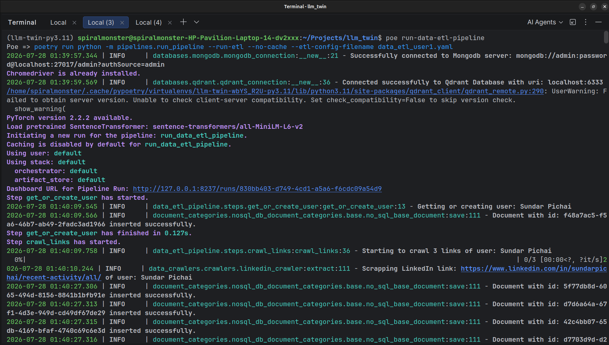

</p>

<p align="center">

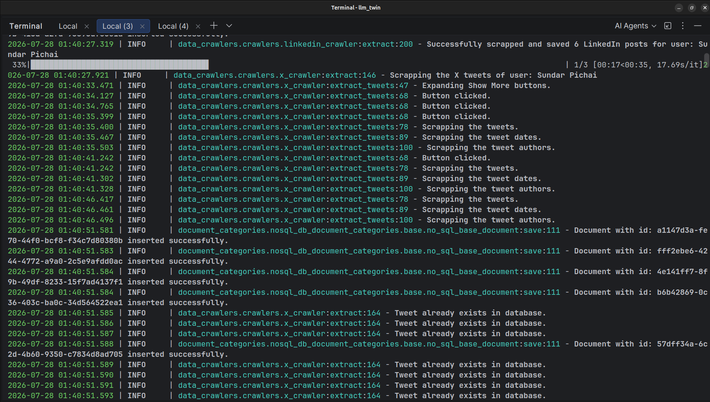

</p>

<p align="center">

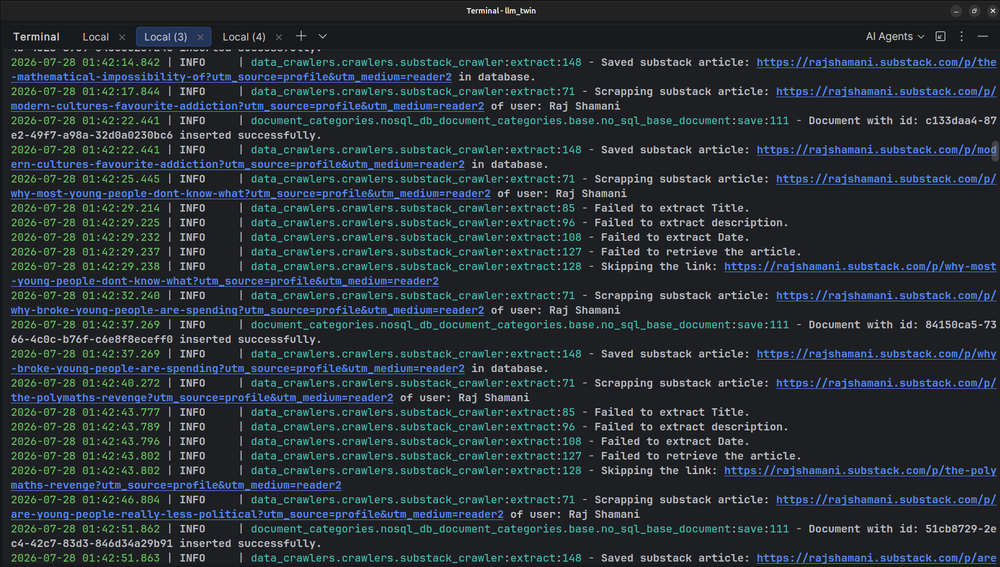

</p>

<p align="center">

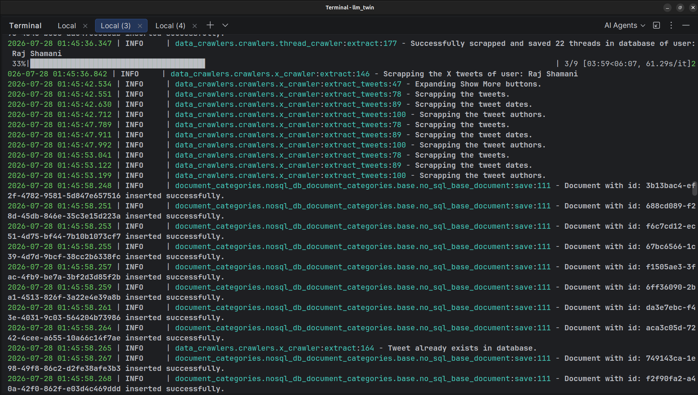

</p>

<p align="center">

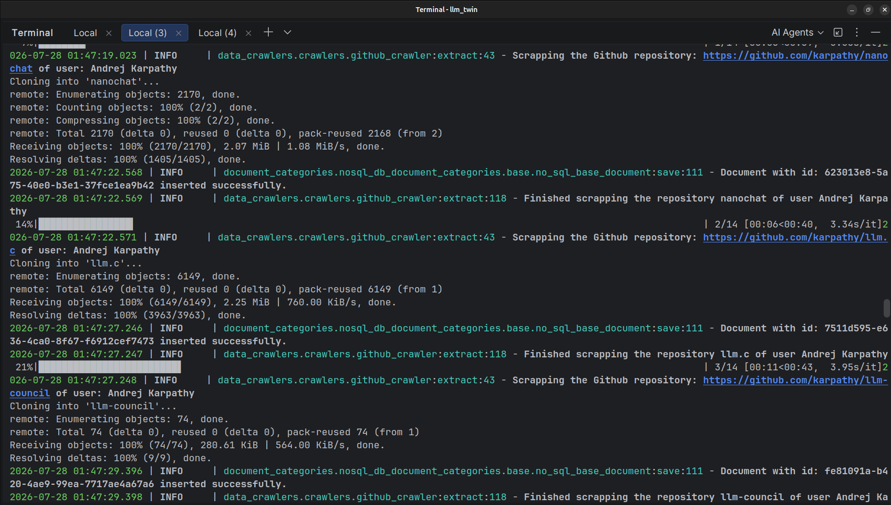

</p>

<p align="center">

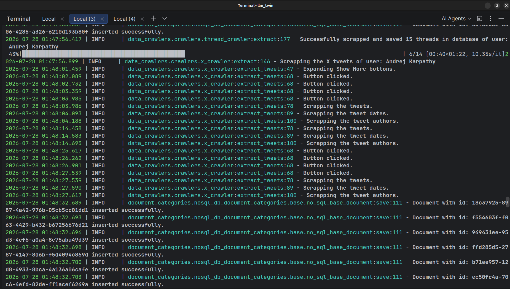

</p>

<p align="center">

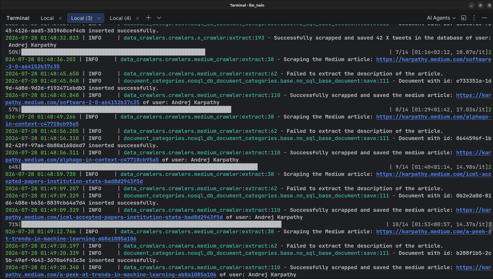

</p>

<p align="center">

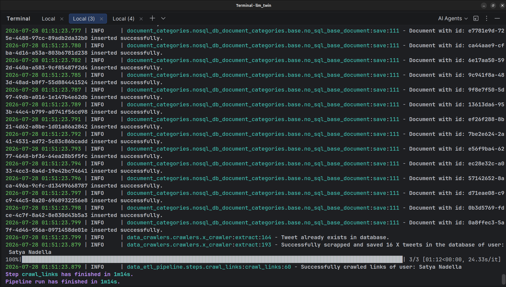

</p>

---

# RAG Feature Pipeline

The RAG Feature Pipeline transforms raw documents into searchable and reusable features.

The major steps are:

1. Query the data warehouse
2. Retrieve documents
3. Clean documents
4. Chunk documents
5. Store chunks in the feature store
6. Generate embeddings
7. Store embeddings along with chunks and metadata in the vector database

The architecture is:

```text
MongoDB
   |
   v
Document
   |
   v
Data Cleaner
   |
   v
CleanedDocument
   |
   v
Data Chunker
   |
   v
ChunkedDocument
   |
   +----------------------+
   |                      |
   v                      v
Qdrant Feature Store   Data Embedder
                          |
                          v
                  EmbeddedDocument
                          |
                          v
                 Qdrant Vector Store
```

TwinLLM uses **Qdrant** as both:

* Feature Store
* Vector Database


## Feature Store Document Architecture

The RAG pipeline implements the following document abstractions.

### VectorBaseDocument

`VectorBaseDocument` is the OVM abstraction used to interact with Qdrant.

### CleanedDocument

`CleanedDocument` is the base class for cleaned documents.

Examples include:

```text
CleanedArticle
CleanedPost
CleanedRepository
CleanedTweet
```

### ChunkedDocument

`ChunkedDocument` is the base class for documents after chunking.

Examples include:

```text
ChunkedArticle
ChunkedPost
ChunkedRepository
ChunkedTweet
```

### EmbeddedDocument

`EmbeddedDocument` represents documents containing:

* Original chunk
* Embedding
* Metadata

Examples include:

```text
EmbeddedArticle
EmbeddedPost
EmbeddedRepository
EmbeddedTweet
```

These objects are eventually stored in Qdrant for retrieval.


## Data Preprocessors

The RAG Feature Pipeline contains three major preprocessing components:

1. Data Cleaners
2. Data Chunkers
3. Data Embedders


### 1. Data Cleaners

TwinLLM uses separate data cleaners for each data category because different types of documents require different cleaning strategies.

Common cleaning operations include:

* Removing extra spaces
* Removing or replacing URLs
* Removing or replacing non-ASCII characters
* Removing stop words
* Lowercasing text
* Removing unnecessary formatting
* Normalizing textual content

The output of this stage is a `CleanedDocument`.

```text
BaseDocument
      |
      v
Data Cleaner
      |
      v
CleanedDocument
```


### 2. Data Chunkers

Different types of content have different natural structures and therefore require different chunking strategies.

TwinLLM implements separate chunkers for each data category.

### ArticleDataChunker

```python
{
    "maximum_chunk_size": 1000,
    "chunk_overlap": 200,
    "minimum_chunk_size": 250
}
```

Articles contain longer-form content, so they use larger chunks and higher overlap.

### PostDataChunker

```python
{
    "maximum_chunk_size": 400,
    "chunk_overlap": 100,
    "minimum_chunk_size": 80
}
```

Posts are generally shorter and therefore use smaller chunks.

### RepositoryDataChunker

```python
{
    "maximum_chunk_size": 1000,
    "chunk_overlap": 0,
    "minimum_chunk_size": 250
}
```

Repository data contains source code and repository-level information, so it uses larger chunks without overlap.

### TweetDataChunker

```python
{
    "maximum_chunk_size": 350,
    "chunk_overlap": 75,
    "minimum_chunk_size": 80
}
```

Tweets are short-form content, so the chunk size is significantly smaller.


### 3. Data Embedders

Each document category has its own data embedder.

The embedding model used across the pipeline is:

```text
sentence-transformers/all-MiniLM-L6-v2
```

Embedding dimension:

```text
384
```

The final transformation is:

```text
ChunkedDocument
       |
       v
DataEmbedder
       |
       v
EmbeddedDocument
```

The resulting embedded documents contain:

```text
Embedding
+
Chunk
+
Metadata
```

and are stored in Qdrant.


## Complete RAG Feature Pipeline

The complete feature-generation flow is:

```text
NoSqlBaseDocument
        |
        v
   Data Cleaner
        |
        v
 CleanedDocument
        |
        v
   Data Chunker
        |
        v
 ChunkedDocument
        |
        +--------------------+
        |                    |
        v                    v
 Feature Store          Data Embedder
   (Qdrant)                  |
                             v
                     EmbeddedDocument
                             |
                             v
                     Vector Store
                       (Qdrant)
```

This allows the same processed data to be reused by both:

* Retrieval
* Dataset generation
* Training pipelines


## Pipeline Run
<p align="center">

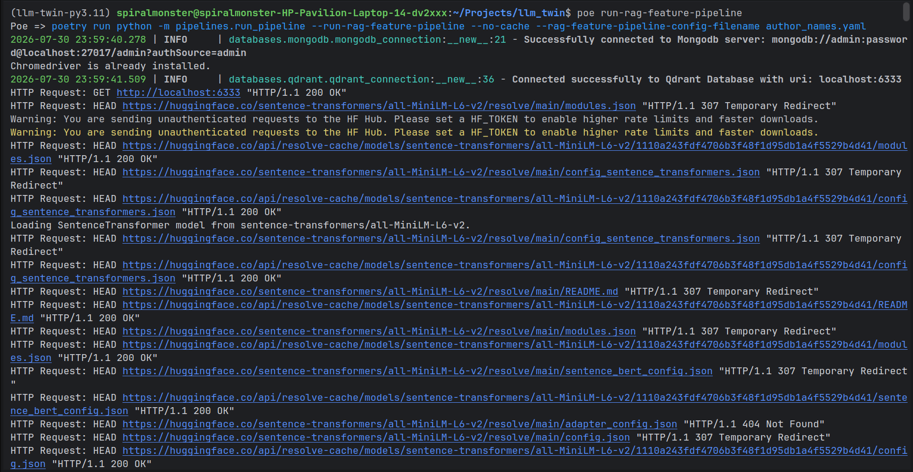

</p>

<p align="center">

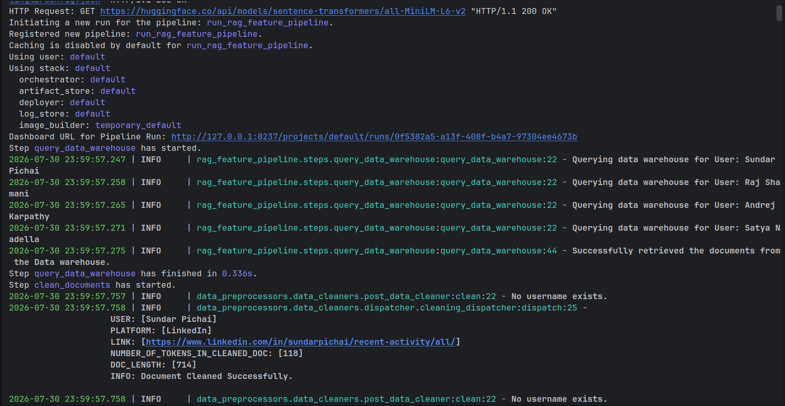

</p>

<p align="center">

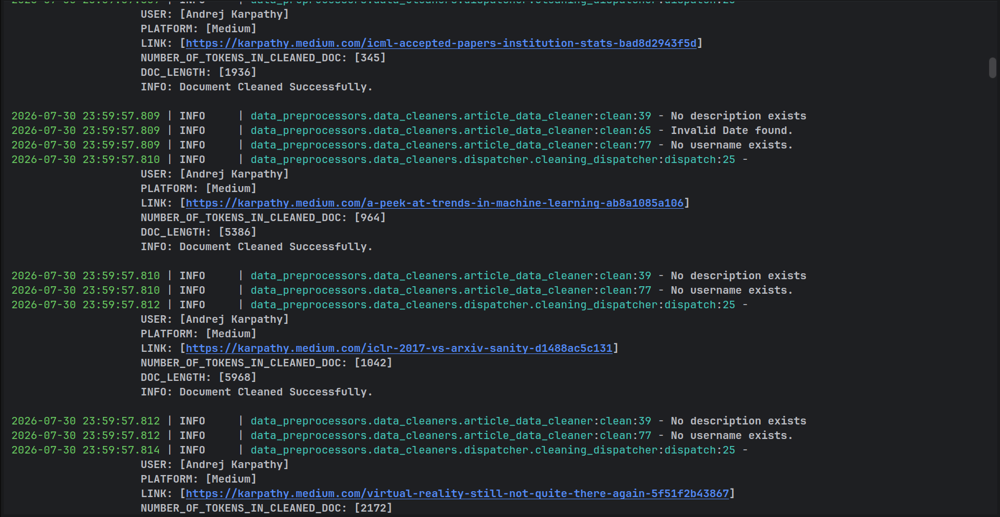

</p>

<p align="center">

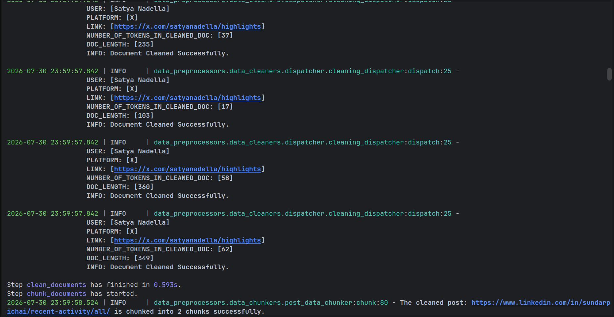

</p>

<p align="center">

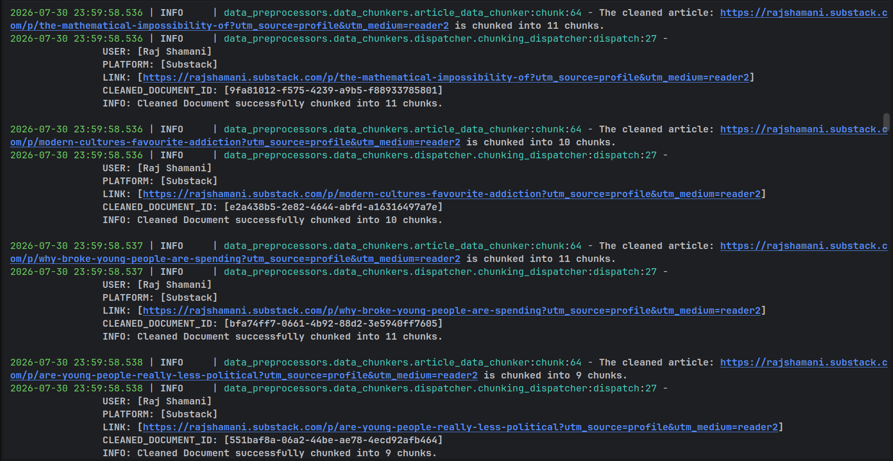

</p>

<p align="center">

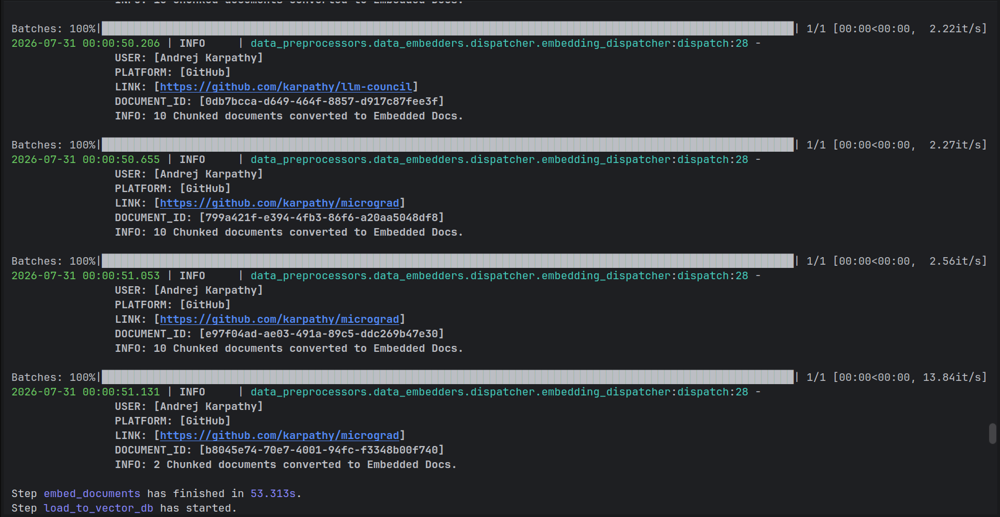

</p>

<p align="center">

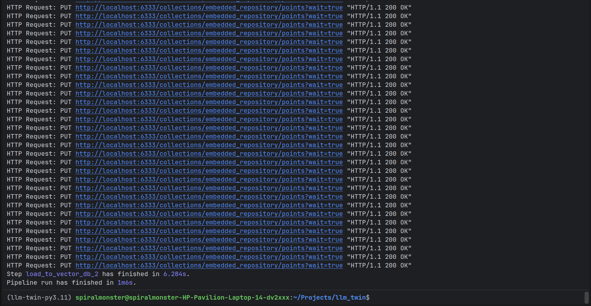

</p>

---

# Instruction Dataset Generating Pipeline

The Instruction Dataset Generation Pipeline converts the author's content into instruction-answer pairs suitable for supervised fine-tuning.

The pipeline is:

```text
Chunked Documents
       |
       v
Instruction Dataset Generator
       |
       v
Instruction Dataset
       |
       v
Hugging Face Hub
```

## Pipeline Steps

1. Load data chunks from the feature store
2. Pass chunks along with metadata to the instruction dataset generator
3. Generate instruction-answer pairs
4. Publish the generated dataset to the Hugging Face Hub


## Synthetic Instruction Generation

TwinLLM uses proprietary LLMs to generate instruction-answer pairs.

The models used are:

* `mistral-medium-latest`
* `command-r-08-2024`
* `llama-3.3-70b-versatile`
* `qwen-flash`

The temperature is set to:

```text
0.6
```

For every data chunk, each model generates one instruction-answer pair.

Therefore:

```text
1 Data Chunk
      |
      +--> Mistral
      +--> Command R
      +--> Llama
      +--> Qwen
      |
      v
4 Instruction-Answer Pairs
```

The multi-model approach is used to increase the diversity of the generated dataset.

Different models can interpret the same source content differently, producing instructions and answers with different structures and perspectives.


## Data-Type-Specific Instruction Generation

Different document categories contain different metadata.

For example:

```text
Article
    title
    description
    username
    published_date

Post
    username
    published_date

Repository
    repository_name
    file_count
    programming_languages_used

Tweet
    username
    published_date
```

Therefore, TwinLLM implements different instruction dataset generators for different document categories.

The main reason is to provide the appropriate metadata to the proprietary LLM during synthetic dataset generation.


## Instruction Dataset Generation Prompt

The general prompt used for instruction generation is:

```text
You are an Instruction Dataset Curator.
You are given some {data_type} data chunks along with it's metadata.
Your job is to generate a pair of instruction and answer for every data chunk.

# Things to remember while generating the instruction-answer pair:
  - Each instruction must ask to write about a specific topic contained in the data chunk.
  - Only use the concepts from the data chunk to generate instruction.
  - Instructions must be self-contained and general.
  - Each answer must provide a relevant paragraph based on the information found in the data chunk.
  - Answers must imitate the writing style of the data chunk.

# Data Chunks:
{data_chunks}
```

The generated dataset is published to the Hugging Face Hub.

Dataset:

```text
spiralMon/llm_twin_instruct_dataset
```

## Pipeline Run

<p align="center">

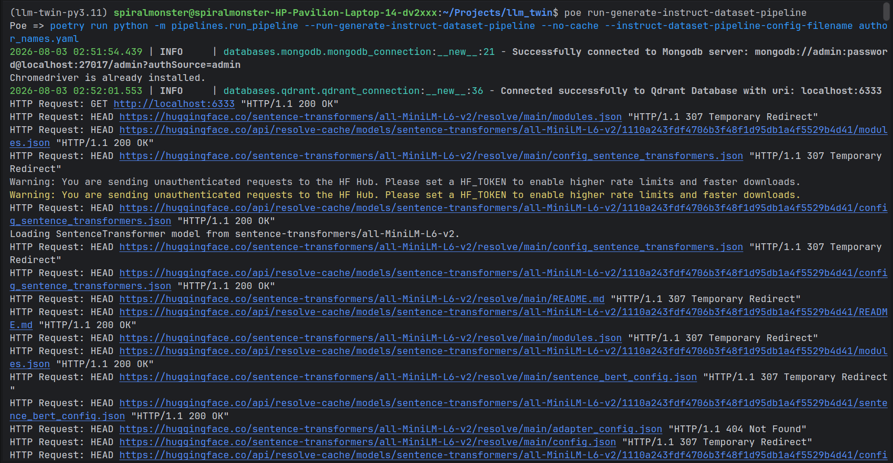

</p>

<p align="center">

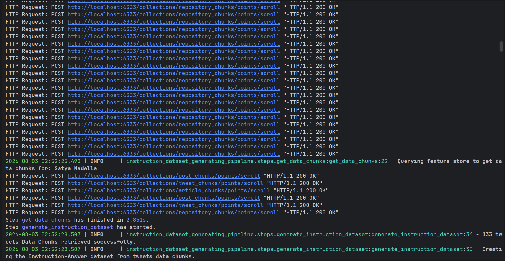

</p>

<p align="center">


</p>

<p align="center">

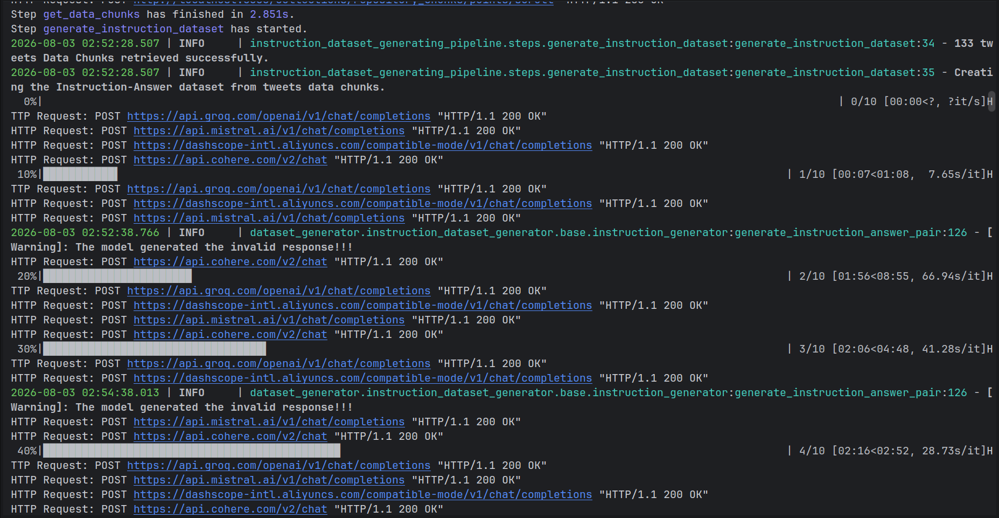

</p>

<p align="center">

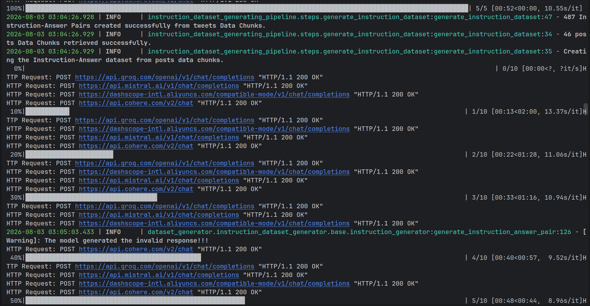

</p>

<p align="center">

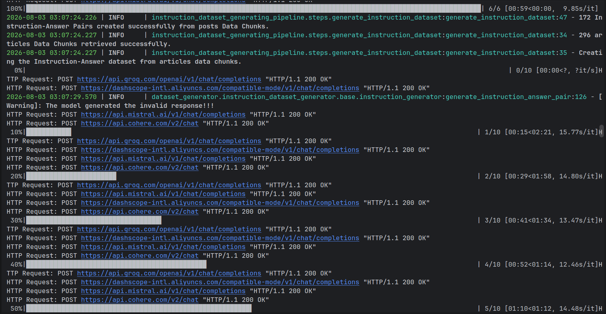

</p>

<p align="center">

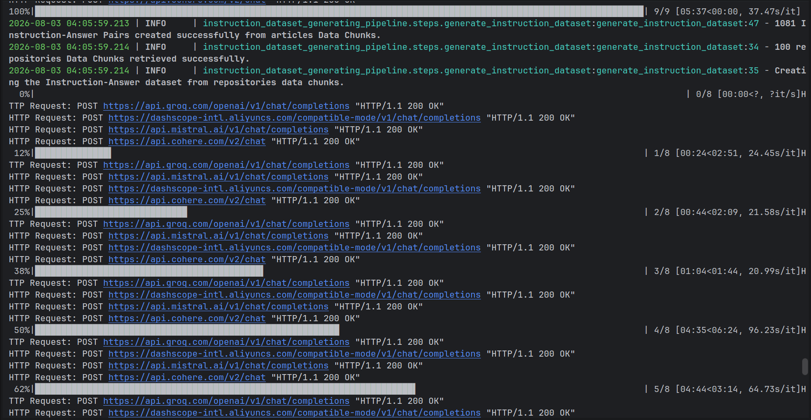

</p>

<p align="center">

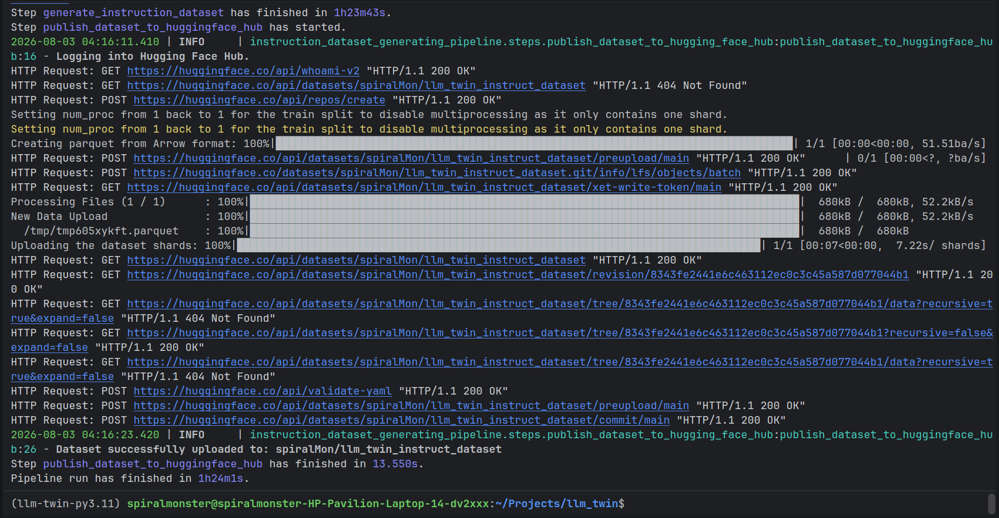

</p>


---

# Data Refinement Pipeline

Synthetic datasets can contain:

* Low-quality examples
* Duplicates
* Toxic content
* Poorly formatted responses
* Semantically redundant examples
* Irrelevant examples

TwinLLM therefore introduces a dedicated **Data Refinement Pipeline** before training.

The pipeline consists of:

1. Rule-Based Filtering
2. Data Deduplication
3. Data Quality Evaluation


## Rule-Based Filtering

Rule-based filtering operates at the instruction and output levels.

### 1. Length-Based Filtering

Instruction and output examples are filtered according to their length requirements.

This prevents extremely short or excessively long examples from entering the training dataset.

Configuration:
```python
INSTRUCTION_LENGTH_BASED_FILTERS={
        "min_length":6,
        "max_length":35
    }

OUTPUT_LENGTH_BASED_FILTERS={
        "min_length":15,
        "max_length":200
    }
```


### 2. Toxicity-Based Filtering

TwinLLM uses:

```text
unitary/toxic-bert
```

to estimate toxicity in both instructions and outputs.

The maximum toxicity threshold is:

```text
0.75
```

Configuration:

```python
INSTRUCTION_TOXICITY_BASED_FILTERS = {
    "maximum_toxicity_threshold": 0.75
}

OUTPUT_TOXICITY_BASED_FILTERS = {
    "maximum_toxicity_threshold": 0.75
}
```


### 3. Format-Based Filtering

TwinLLM validates the format of both instructions and outputs.

The filters are:

```python
INSTRUCTION_FORMAT_BASED_FILTERS = {
    "start_with_capital": True,
    "end_with_punctuation": True
}

OUTPUT_FORMAT_BASED_FILTERS = {
    "start_with_capital": True,
    "end_with_punctuation": True
}
```

This ensures that generated training examples follow basic linguistic formatting conventions.


## Data Deduplication

TwinLLM uses three levels of deduplication.

### 1. Exact Deduplication

Exact duplicate instruction-output pairs are removed.

```text
Instruction A + Output A
Instruction A + Output A
```

becomes:

```text
Instruction A + Output A
```


### 2. Fuzzy Deduplication

Fuzzy deduplication is performed using the **MinHash** algorithm.

Configuration:

```python
{
    "algorithm": "MIN-HASH",
    "shingle_length": 10,
    "number_of_hashes_per_document": 128,
    "similarity_measure": "Jaccard Similarity",
    "minimum_similarity_threshold": 0.85
}
```

Pairs with a Jaccard similarity above the configured threshold are considered sufficiently similar for deduplication.


### 3. Semantic Deduplication

Semantic deduplication removes examples that may be worded differently but have essentially the same meaning.

The configuration is:

```python
{
    "embedding_model": "sentence-transformers/all-MiniLM-L6-v2",
    "embedding_model_dim": 384,
    "embedding_database": "HNSW",
    "similarity_measure": "cosine similarity",
    "minimum_cosine_similarity_threshold": 0.75
}
```

This provides an additional layer of deduplication beyond exact and lexical similarity.


## Data Quality Evaluation

After filtering and deduplication, TwinLLM evaluates the quality of the generated instruction-output pairs using an **LLM-as-a-Judge** approach.

The evaluation metrics are:

* Helpfulness
* Correctness
* Complexity
* Coherence
* Relevance
* Verbosity

The evaluator model is:

```text
mistral-medium-latest
```

with:

```text
temperature = 0.3
```

Each metric receives a score from:

```text
1 → Worst
5 → Best
```

The total score is calculated across all six metrics.

Examples with a total score below:

```text
12
```

are filtered out.


### LLM-as-a-Judge Prompt

```text
You are a Data Quality Evaluator.
Your job is to evaluate the given Instruction-Output Pairs based on the following Metrics:
  - Helpfulness: Whether the content fully addresses the user's request and provides actionable guidance.
  - Correctness: Whether the content is factually accurate, logically sound and free of hallucinations.
  - Coherence: Whether the content is well organized, easy to follow, with ideas presented in logical sequence.
  - Complexity: Whether the content uses an appropriate level of depth and sophistication along with avoiding unnecessary complication.
  - Relevance: Whether the provided output is relevant to the instruction proposed.
  - Verbosity: Whether the content provides the right amount of details for the user's request.

For each metric you have to output a score between 1 to 5.
A score of '1' points to the worst and a score of '5' points to the best data quality.

Instruction-Output Pairs:
{instruction_output_pairs}
```


## Refined Datasets

The Data Refinement Pipeline produces two datasets.

### Evaluated Instruction Dataset

This dataset contains the original instruction dataset along with additional columns containing the evaluation results.

Dataset:

```text
spiralMon/llm_twin_instruct_evaluated_dataset
```

### Cleaned Instruction Dataset

This dataset contains only examples that successfully pass the refinement process.

Dataset:

```text
spiralMon/llm_twin_instruct_cleaned_dataset
```

The overall workflow is:

```text
Instruction Dataset
        |
        v
Rule-Based Filtering
        |
        v
Deduplication
        |
        v
LLM-as-a-Judge
        |
        +----------------------+
        |                      |
        v                      v
Evaluated Dataset       Cleaned Dataset
```

## Pipeline Run

<p align="center">

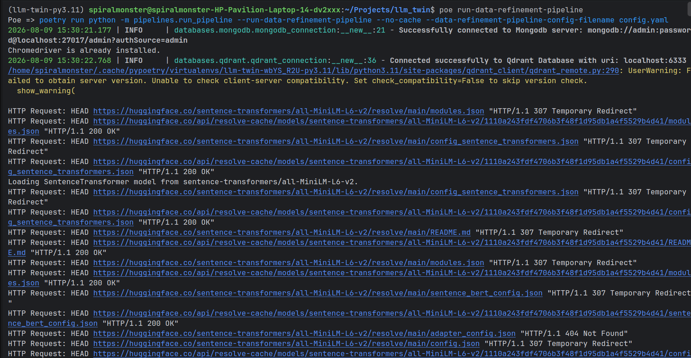

</p>

<p align="center">

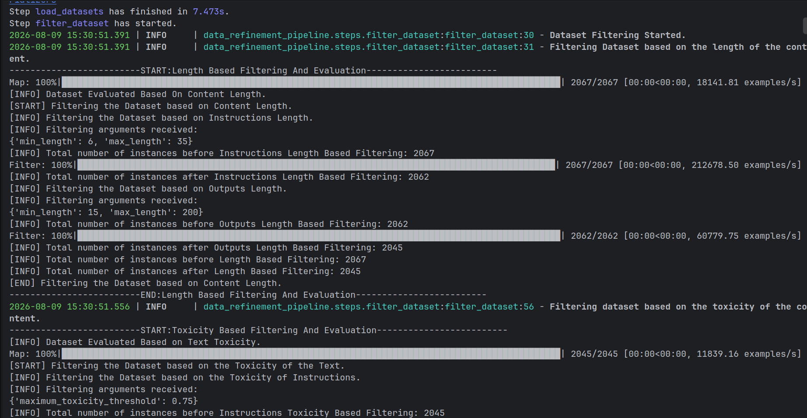

</p>

<p align="center">

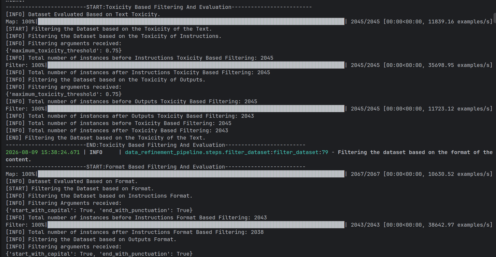

</p>

<p align="center">

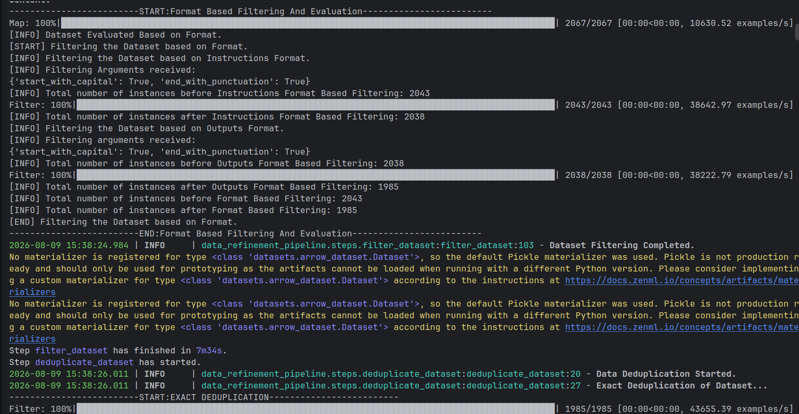

</p>

<p align="center">

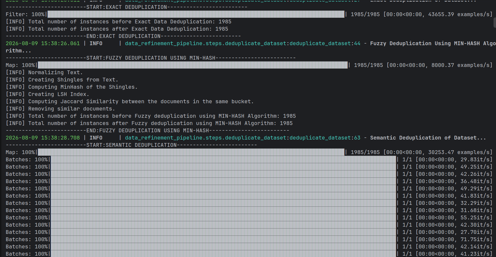

</p>

<p align="center">

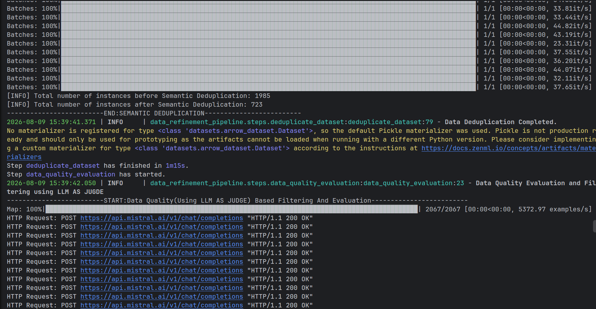

</p>

<p align="center">

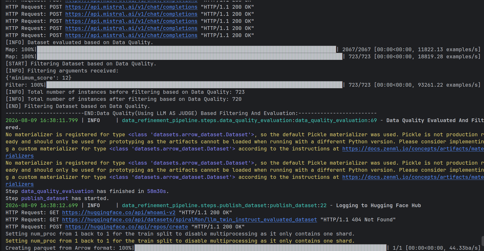

</p>

<p align="center">

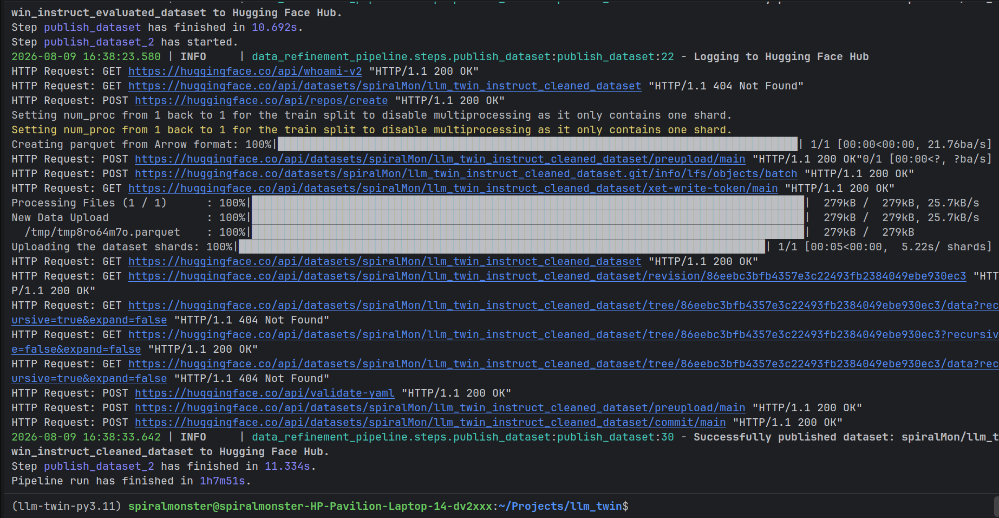

</p>


---

# Preference Dataset Generating Pipeline

In addition to instruction tuning, TwinLLM uses preference optimization to teach the model which responses better represent the author's writing style.

The pipeline is:

```text
Chunked Documents
       |
       v
Preference Dataset Generator
       |
       v
Preference Dataset
       |
       v
Hugging Face Hub
```


## Preference Dataset

For every data chunk, the generator produces a triplet:

```text
Instruction
Chosen Answer
Rejected Answer
```

The **chosen answer** imitates the author's writing style.

The **rejected answer** answers the same instruction in a generic style without imitating the author's style.

This gives the preference optimization algorithm a direct signal about which response better represents the desired writing behavior.


## Preference Dataset Models

The same multi-model approach used for instruction generation is used here.

Models:

* `mistral-medium-latest`
* `command-r-08-2024`
* `llama-3.3-70b-versatile`
* `qwen-flash`

Temperature:

```text
0.4
```

Each model generates one preference triplet for every data chunk.


## Preference Dataset Prompt

```text
You are a Preference Dataset Curator.
You are provided with some {data_type} data chunks.
Your job is to generate a triplet of instruction, chosen answer and rejected answer for each data chunk.

# Things to remember while generating the triplet:
  - Each instruction must ask to write about a specific topic contained in the data chunk.
  - Only use the concepts from the data chunk to generate instruction.
  - Instructions must be self contained and general.
  - Each chosen answer must imitate the writing style of the data chunk, so that it seems to be written by the author of data chunk.
  - Each rejected answer should be more of a general way of answering the instruction, without imitating any writing style of data chunk.

# Data Chunks:
{data_chunks}
```

Dataset:

```text
spiralMon/llm_twin_preference_dataset
```

## Pipeline Run
<p align="center">

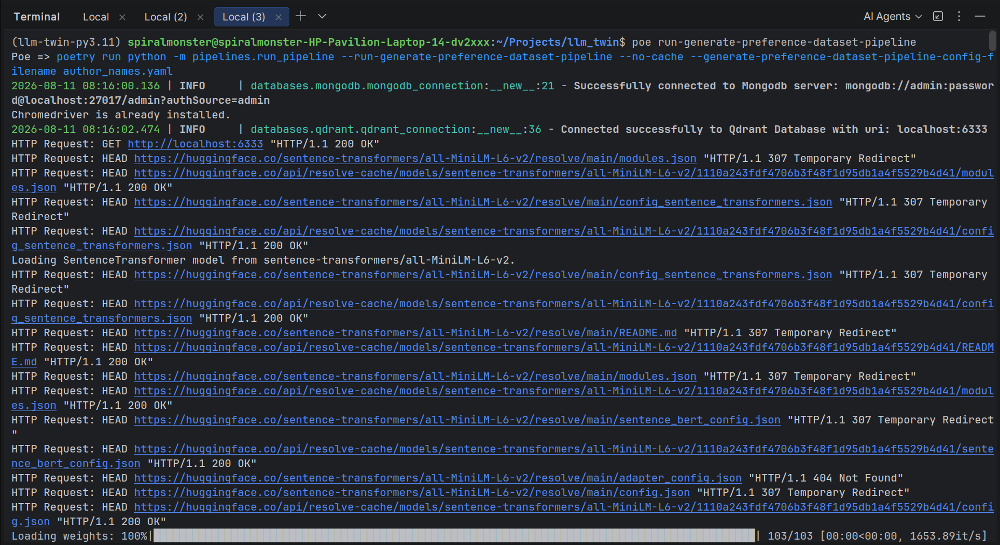

</p>

<p align="center">

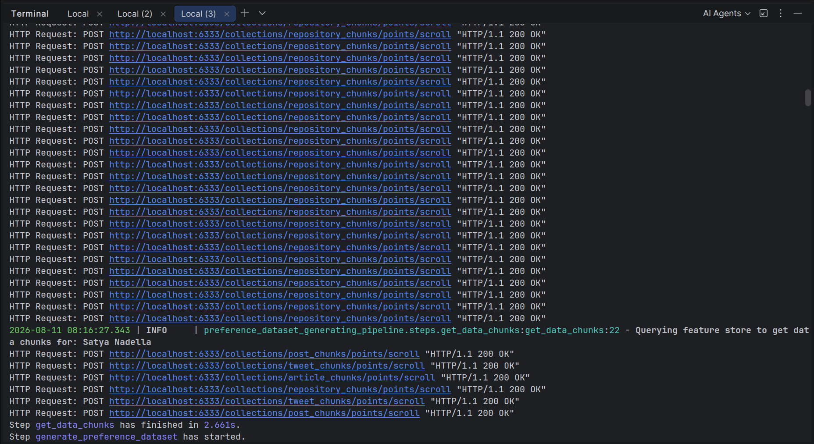

</p>

<p align="center">

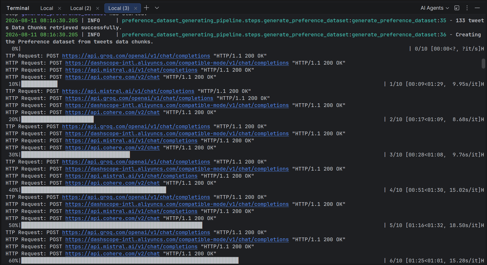

</p>

<p align="center">

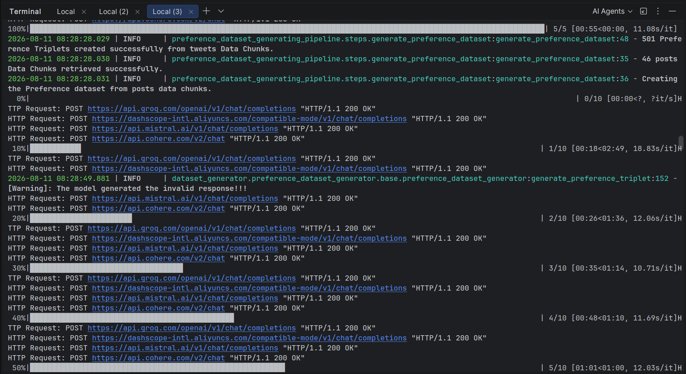

</p>

<p align="center">

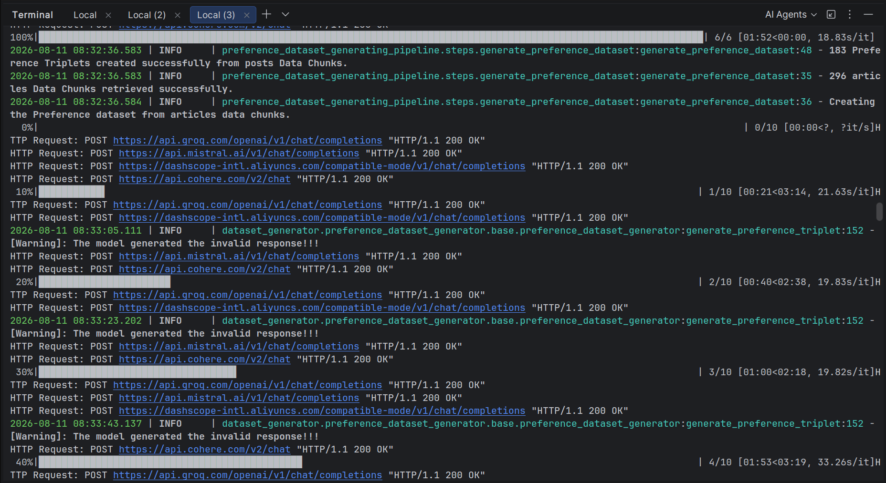

</p>

<p align="center">

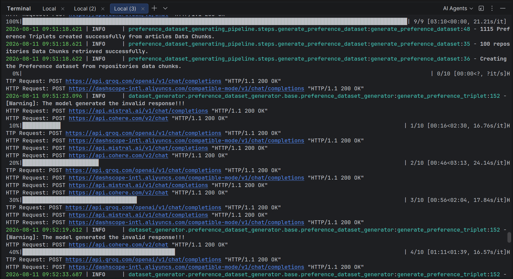

</p>

<p align="center">

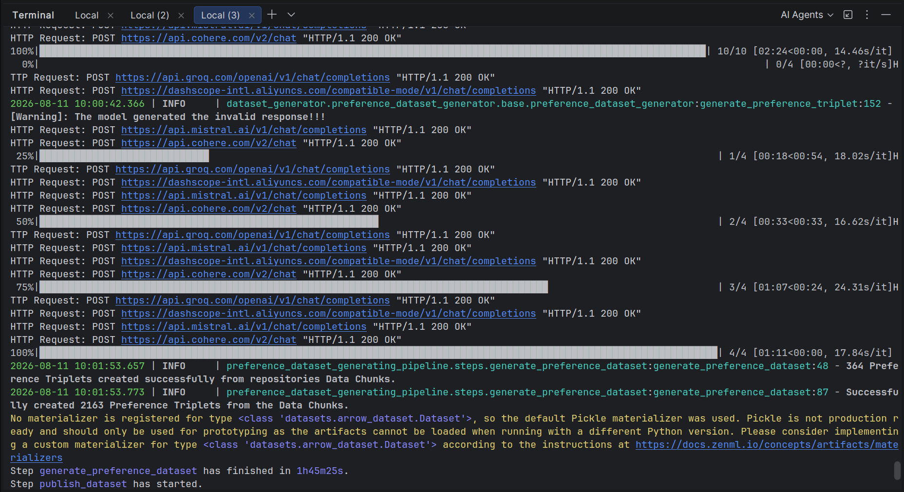

</p>

---

# Training Pipeline

The Training Pipeline transforms the generated datasets into a personalized language model.

The training process consists of two major stages:

```text
Cleaned Instruction Dataset
            |
            v
      SFT + LoRA
            |
            v
     Instruction Model
            |
            v
Preference Dataset
            |
            v
      DPO + LoRA
            |
            v
       TwinLLM Model
```

TwinLLM uses:

* Unsloth
* TRL
* LoRA
* Supervised Fine-Tuning
* Direct Preference Optimization

---

# Supervised Fine-Tuning

The first training stage fine-tunes an open-source:

```text
Llama-3.1-8B
```

model on the cleaned instruction dataset.

The steps are:

1. Load the cleaned instruction dataset from Hugging Face Hub
2. Load the Llama-3.1-8B base model
3. Apply LoRA adapters
4. Perform supervised fine-tuning
5. Push the resulting model to the model registry

The model registry used by TwinLLM is the Hugging Face Hub.


## LoRA Configuration

The LoRA configuration is:

```python
lora_rank = 32
lora_alpha = 32
lora_dropout = 0

target_modules = [
    "q_proj",
    "k_proj",
    "v_proj",
    "up_proj",
    "down_proj",
    "o_proj",
    "gate_proj"
]
```


## SFT Training Configuration

```python
SFTConfig(
    output_dir="output",
    dataset_text_field="text",
    max_seq_length=max_seq_length,
    packing=True,
    dataset_num_proc=2,
    per_device_train_batch_size=2,
    gradient_accumulation_steps=8,
    learning_rate=3e-4,
    lr_scheduler_type="linear",
    num_train_epochs=4,
    fp16=not is_bfloat16_supported(),
    bf16=is_bfloat16_supported(),
    logging_steps=1,
    optim="adamw_8bit",
    weight_decay=0.01,
    warmup_steps=10,
    report_to="comet_ml",
    seed=0
)
```

The resulting model is available as:

```text
spiralMon/Twin-LLM-Fine-Tuned-Instruct-Model-Llama-3.1-8B-bnb-4bit
```

---

# Direct Preference Optimization

After supervised fine-tuning, the instruction-tuned model is further optimized using **Direct Preference Optimization (DPO)**.

The steps are:

1. Load the preference dataset
2. Load the instruction-tuned model
3. Apply LoRA adapters
4. Train using DPO
5. Push the final model to the Hugging Face Hub

DPO teaches the model to prefer responses that better match the author's writing style over generic responses.


## DPO LoRA Configuration

```python
lora_rank = 32
lora_alpha = 32
lora_dropout = 0

target_modules = [
    "q_proj",
    "k_proj",
    "v_proj",
    "up_proj",
    "down_proj",
    "o_proj",
    "gate_proj"
]
```


## DPO Training Configuration

```python
DPOConfig(
    learning_rate=2e-6,
    lr_scheduler_type="linear",
    per_device_train_batch_size=2,
    per_device_eval_batch_size=2,
    gradient_accumulation_steps=8,
    num_train_epochs=3,
    fp16=not is_bfloat16_supported(),
    bf16=is_bfloat16_supported(),
    optim="adamw_8bit",
    weight_decay=0.01,
    warmup_steps=10,
    output_dir="output",
    eval_strategy="steps",
    eval_steps=0.2,
    logging_steps=1,
    report_to="comet_ml",
    seed=0
)
```

The final DPO model is available as:

```text
spiralMon/Twin-LLM-Fine-Tuned-DPO-Model-Llama-3.1-8B
```

---

# Inference Pipeline

The inference pipeline is responsible for generating personalized responses for users.

The overall flow is:

```text
User Query
    |
    v
Context Retrieval
    |
    v
Prompt Creation
    |
    v
Deployed TwinLLM
    |
    v
Generated Response
    |
    v
Conversation Handling
    |
    v
Prompt Monitoring
```

The inference system uses a **microservice architecture**.

The RAG and application logic are exposed through **FastAPI**, while the fine-tuned LLM is deployed separately on cloud infrastructure.

---

# Context Retriever

The context retriever is one of the most important components of TwinLLM.

Instead of directly performing vector search against every document, the system performs a sequence of pre-retrieval, retrieval, and post-retrieval operations.

```text
User Query
    |
    v
Pre-Retrieval
    |
    +--> Self Querying
    |
    +--> Query Reconstruction
    |
    +--> Query Expansion
    |
    +--> Query Routing
    |
    v
Retrieval
    |
    +--> Metadata Filtering
    |
    +--> Vector Search
    |
    v
Post-Retrieval
    |
    +--> Reranking
    |
    v
Final Context
```
---

## Pre-Retrieval

### 1. Self-Querying

The first step extracts metadata from the user query.

Potential metadata includes:

* User ID
* User full name
* Platform name

The system uses few-shot prompting.

Example:

```text
Query:
Hey, I am Paul Atreides. Can you tell me about supervised fine-tuning?

Metadata:
user_id: None
user_full_name: Paul Atreides
platform_name: None
```

Another example:

```text
Query:
Hey, I am Justin Paul. Can you help me in writing some tweets to post on X?

Metadata:
user_id: None
user_full_name: Justin Paul
platform_name: X
```

The extracted metadata is later used to narrow the retrieval search space.


### 2. Query Reconstruction

The reconstructed query removes metadata while preserving the semantic meaning of the original query.

For example:

```text
Original Query:
Hey, I am Paul Atrides. Can you write an article about Supervised Fine-tuning?

Reconstructed Query:
Write an article about Supervised Fine-Tuning.
```

The query reconstruction prompt follows two principles:

* Remove metadata
* Preserve semantic meaning

This allows the vector search system to focus on the actual information requirement instead of personal metadata embedded in the query.

The approach uses few-shot prompting.


### 3. Query Expansion

A single query may not retrieve all relevant contexts.

TwinLLM therefore expands the reconstructed query into multiple semantically related queries.

For example:

```text
Original:
Explain what is supervised fine tuning?

Expanded:
- How is supervised fine tuning implemented?
- When should supervised fine tuning be used?
- Give a code illustration of supervised fine tuning.
```

Query expansion is used to retrieve different perspectives from the author's content.

The system generates:

```text
NUM_QUERY_EXPANSIONS = 4
```

queries.

This uses one-shot prompting.


### 4. Query Routing

Query routing determines which document categories are relevant to the query.

Available document categories are:

```text
Article
Post
Tweet
Code
None
```

The router can return multiple document categories.

For example:

```text
Query:
Write a technical article explaining how I implemented RAG.

Router:
Article
Repository
```

This prevents the system from searching every document category for every query.

The approach uses zero-shot prompting.

---


## Retrieval

### Filtered Vector Search

After query routing, TwinLLM performs a filtered vector search.

The retrieval process uses:

1. Document category
2. Metadata
3. Semantic similarity

Metadata can include fields such as:

* User ID
* User name
* Platform
* Other document-specific metadata

The search space is first narrowed using metadata and routing information.

Vector similarity search is then performed against the relevant Qdrant collections/documents.


---

## Post-Retrieval

### Reranking

The initially retrieved documents are not directly passed to the model.

Instead, TwinLLM uses a reranker to determine which retrieved documents are most relevant to the original query.

The reranker is a cross-encoder model:

```text
cross-encoder/ms-marco-MiniLM-L-4-v2
```

The cross encoder receives:

```text
Query + Retrieved Document
```

and produces a relevance score.

The retrieved documents are then sorted based on this score.

Highest relevance:

```text
Document 1
```

Lowest relevance:

```text
Document N
```

This improves the quality of the final context supplied to the model.

---

## RAG Parameters

The primary retrieval parameters are:

```python
NUM_QUERY_EXPANSIONS = 4
DOCS_TO_RETRIEVE_PER_QUERY = 3
DOCS_TO_KEEP_IN_CONTEXT = 5
```

Therefore, the retriever can initially retrieve multiple documents across multiple query variants and then reduce them to the most relevant contexts.

---

# Prompt Creation

Once relevant documents are retrieved, TwinLLM creates the final prompt.

The process is:

```text
User Query
     |
     v
Context Retriever
     |
     v
Retrieved Documents
     |
     v
Category-Specific Context Formatting
     |
     +---- Metadata
     |
     +---- Content
     |
     +---- Conversation History
     |
     +---- Conversation Summary
     |
     v
Final Prompt
```

The prompt is crafted differently depending on the retrieved document category.

The relevant metadata and document content are included in the context.

The system also retrieves:

* Recent conversation history
* Conversation summary

from the feature store.


## Final Model Prompt

The generated prompt follows this structure:

```text
Below is an instruction that describes a task. Write a response that appropriately completes the request.

### Instruction:
{}

### Context Gathered:
{}

### Conversation History:
{}

### Conversation Summary:
{}

### Response:
```

This allows the model to combine:

* User intent
* Author-specific context
* Previous conversation
* Long-term conversation summary

when generating a response.

## Prompt Creation Run

<p align="center">

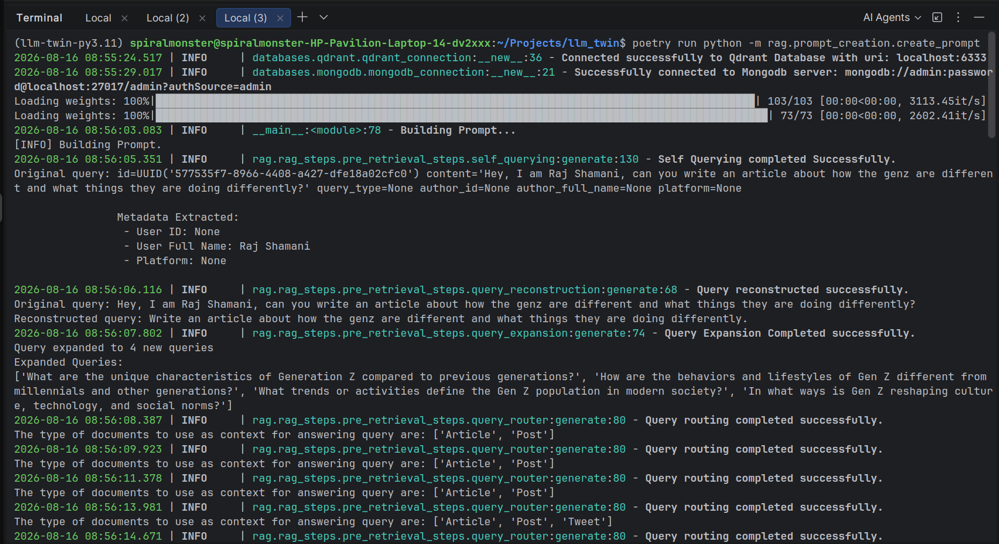

</p>

<p align="center">

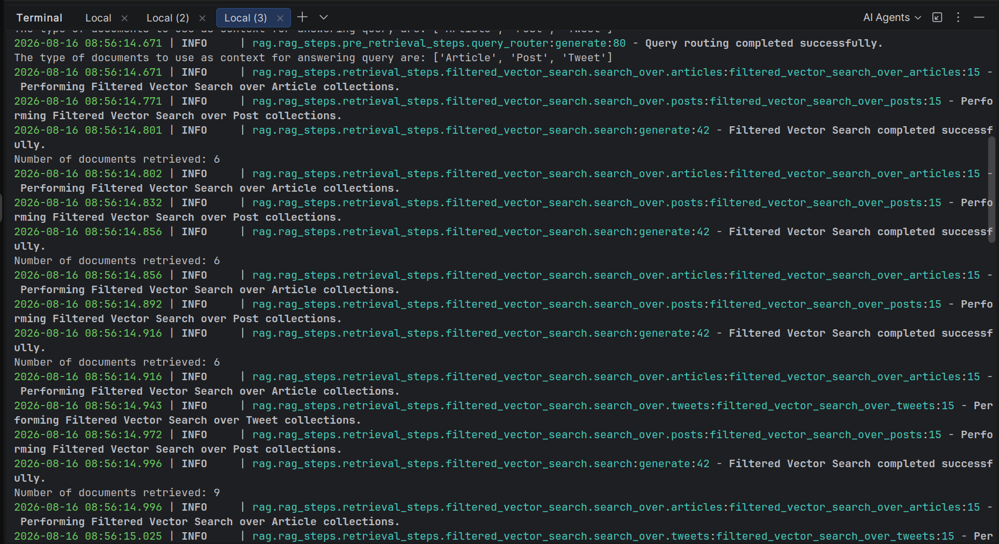

</p>

<p align="center">

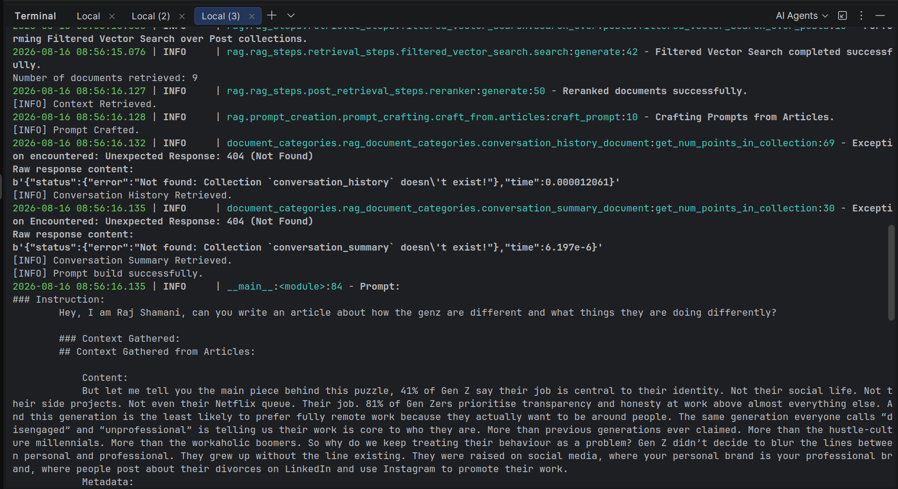

</p>

<p align="center">

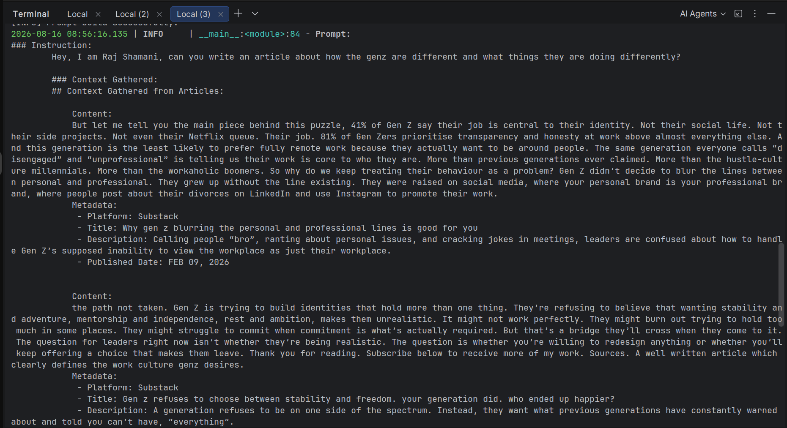

</p>

<p align="center">

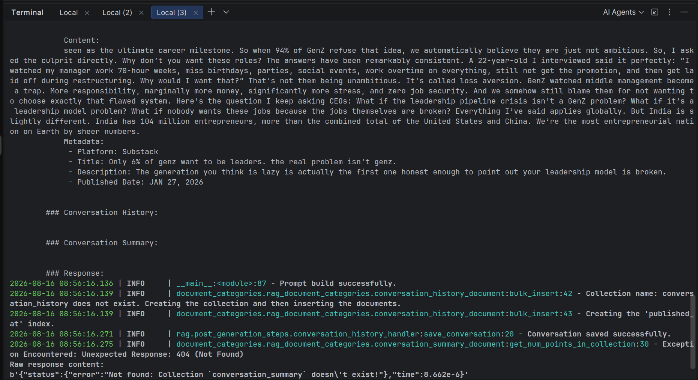

</p>

<p align="center">

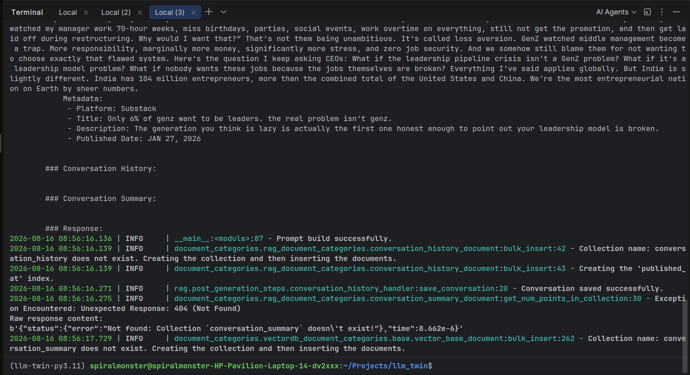

</p>

---

# Post-Generation Processing

TwinLLM performs additional processing after model generation.

The major components are:

1. Conversation History Handler
2. Conversation Summary Handler


---

## Conversation History Handler

The conversation history handler stores user-model conversation pairs in the feature store.

This allows previous turns to be retrieved and included as context for future requests.

The number of recent conversations retrieved is:

```python
NUM_OF_CONVERSATION_TO_RETRIEVE = 3
```

The flow is:

```text
User Query
    +
Model Response
    |
    v
Conversation History
    |
    v
Feature Store
```

### Screenshot

<p align="center">

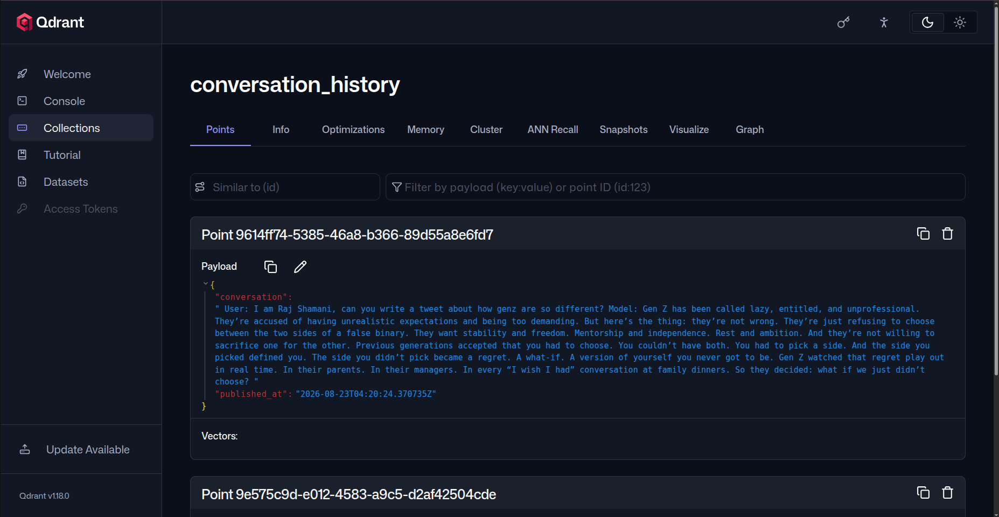

</p>

<p align="center">

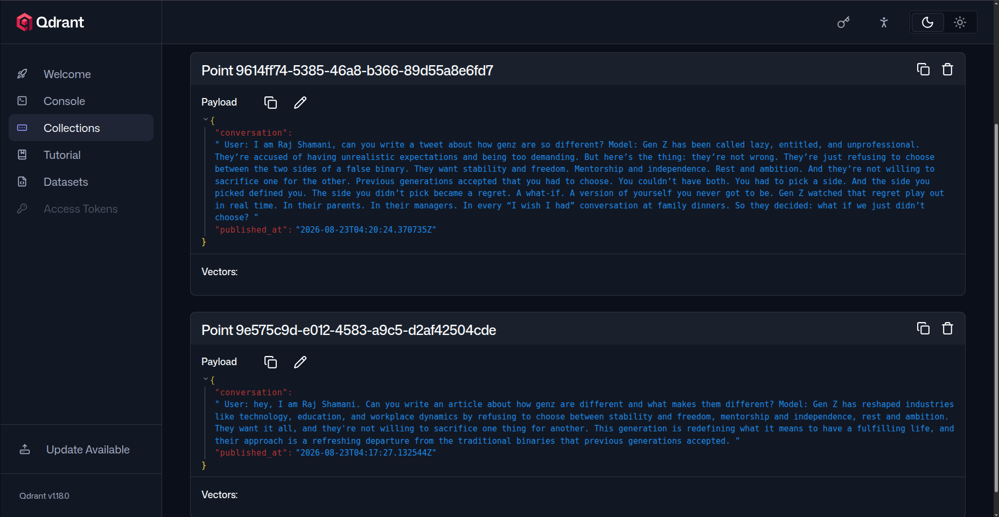

</p>


---


## Conversation Summary Handler

Sending the complete conversation history to the model indefinitely would increase the context size.

TwinLLM therefore maintains a conversation summary.

The summary is updated using a proprietary LLM.

The summary generation prompt is:

```text
You are provided with a recent summary of conversation between the user and chat model along with their current conversation turn.
Your job is to create a precised summary based on it.

# Recent Summary:
{recent_summary}

# Conversation Turn:
{conversation_turn}
```

For the inference-side auxiliary LLM operations, TwinLLM uses:

```text
mistral-medium-latest
```

with:

```text
temperature = 0.3
```

This helps maintain conversational context while controlling prompt size.

### Screenshot

<p align="center">

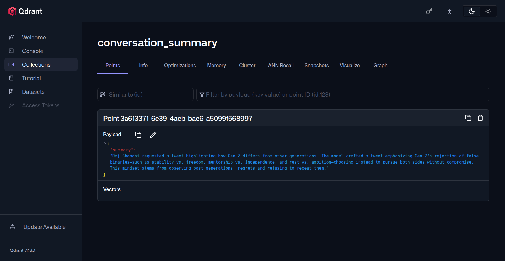

</p>


---

# Microservice Architecture

TwinLLM separates the RAG/application logic from model serving.

```text
                  Streamlit
                      |
                      v
                  FastAPI
                      |
        +-------------+-------------+
        |             |             |
        v             v             v
      RAG       Prompt Creation   Conversation
        |             |             |
        +-------------+-------------+
                      |
                      v
              Cloud Model Endpoint
                      |
                      v
                 TwinLLM Model
```

This separation provides several advantages:

* Independent model deployment
* Independent API scaling
* Easier model replacement
* Clear separation of concerns
* Easier development and debugging

---

# Model Deployment

TwinLLM supports model deployment on both:

* Google Cloud Platform
* Amazon Web Services

The deployed model is consumed by the FastAPI inference service.

---

## GCP Deployment

TwinLLM uses **Vertex AI** for model deployment on GCP.

The deployment process consists of:

1. Enable required GCP API services
2. Validate infrastructure availability in the selected GCP region
3. Create a custom PyTorch inference server image
4. Push the image to Artifact Registry
5. Upload model weights from Hugging Face Hub to a GCS bucket
6. Create the Vertex AI model using:

   * Serving image URI
   * Model artifact URI
7. Create a Vertex AI endpoint
8. Deploy the model to the endpoint

The deployment architecture is:

```text
Hugging Face Model
       |
       v
     GCS
       |
       v
Vertex AI Model
       |
       v
Vertex AI Endpoint
       |
       v
   NVIDIA L4 GPU
```


### GCP Deployment Configuration

```python
GCP_BUCKET_NAME = "llm-twin-storage"
GCP_MODEL_ARTIFACT_PREFIX = "models"

CUSTOM_PYTORCH_INFERENCE_IMAGE = \
    "twin-pytorch_inference_server:transformers-5.14.1"

GCP_REPOSITORY_NAME = "twin-llm-container-images"

GCP_ENDPOINT_NAME = "twin-llm-endpoint"

GCP_MACHINE_TYPE = "g2-standard-8"
GCP_ACCELERATOR_TYPE = "NVIDIA_L4"
GCP_ACCELERATOR_COUNT = 1

GCP_MIN_REPLICA_COUNT = 1
GCP_MAX_REPLICA_COUNT = 1
```

The custom inference image is used to provide a controlled model-serving environment and avoid incompatibilities between the model, inference server, and transformer versions.

## GCP Deployment Screenshots
<p align="center">

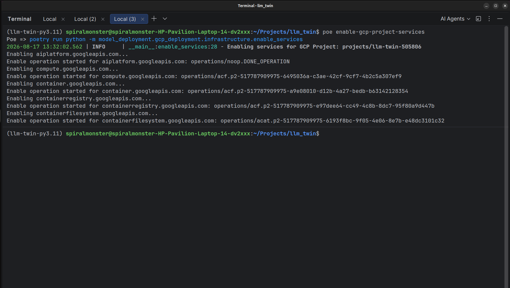

</p>

<p align="center">

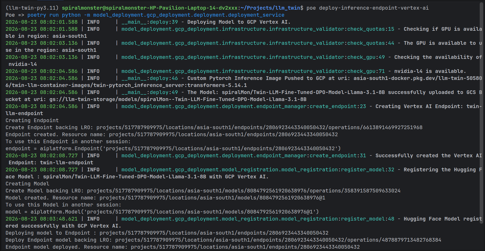

</p>

<p align="center">

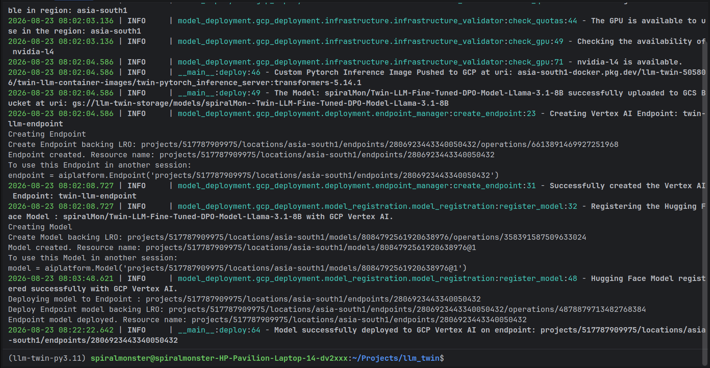

</p>

<p align="center">

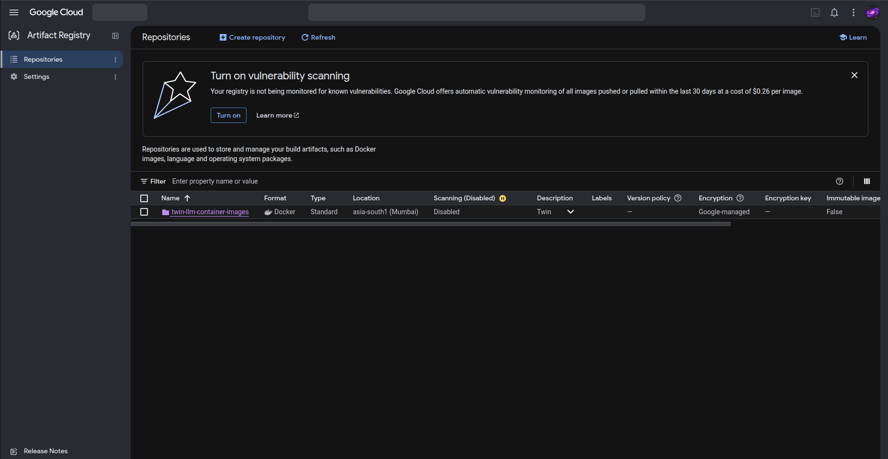

</p>

<p align="center">


</p>

<p align="center">


</p>

<p align="center">


</p>

<p align="center">


</p>

<p align="center">


</p>

<p align="center">


</p>

<p align="center">


</p>

<p align="center">


</p>

<p align="center">


</p>

<p align="center">


</p>

<p align="center">


</p>

<p align="center">


</p>

<p align="center">


## GCP Resource Cleaning Screenshots
</p>

<p align="center">


</p>

<p align="center">


</p>

---

# AWS Deployment

TwinLLM also includes an AWS deployment workflow using **Amazon SageMaker**.

The deployment process consists of:

1. Create SageMaker IAM and execution roles
2. Create endpoint configuration
3. Create the model using `HuggingFaceModel`
4. Create the endpoint
5. Deploy the model to the endpoint

The architecture is:

```text
Hugging Face Model
       |
       v
SageMaker Model
       |
       v
Endpoint Configuration
       |
       v
SageMaker Endpoint
       |
       v
GPU Inference
```


## AWS Deployment Configuration

```python
NUM_OF_REPLICAS = 1
NUM_OF_GPU = 1
NUM_OF_CPU_CORES = 2

SM_NUM_GPUS = 1
MIN_MEMORY = 5 * 1024

GPU_INSTANCE = "ml.g5.xlarge"

SAGEMAKER_ENDPOINT_CONFIG_NAME = "llm-twin"
SAGEMAKER_ENDPOINT_NAME = "llm-twin"
```

TwinLLM also provides a cleanup script to remove the cloud resources created during deployment.

This helps prevent unnecessary cloud resource usage and costs.

---

# Model Inference

Once the model is deployed, FastAPI sends the generated prompt to the cloud endpoint.

The deployed model generates the response, which is then returned to the application.

The inference configuration is:

```python
MAX_INPUT_LENGTH = 2048
MAX_TOTAL_TOKENS = 4096
MAX_BATCH_TOTAL_TOKENS = 4096

MAX_NEW_TOKENS_INFERENCE = 256

TEMPERATURE_INFERENCE = 0.25
TOP_P_INFERENCE = 0.9
```

The relatively low inference temperature helps maintain a more consistent writing style while still allowing the model to produce varied responses.

## Model Inference Screenshot
<p align="center">


</p>
---

# Application

TwinLLM provides a user-facing interface built with **Streamlit**.

The user can request the model to generate:

* LinkedIn-style posts
* Long-form articles
* Tweets
* Code

The application architecture is:

```text
                   User
                    |
                    v
                Streamlit
                    |
                    v
                 FastAPI
                    |
          +---------+---------+
          |                   |
          v                   v
    RAG / Prompt         Cloud Model
      Pipeline             Endpoint
          |                   |
          +---------+---------+
                    |
                    v
              Generated Output
                    |
                    v
                 Streamlit
```

The Streamlit application is intentionally kept separate from the model-serving infrastructure.

## Streamlit Application Screenshots

<p align="center">


</p>

<p align="center">


</p>

<p align="center">


</p>

<p align="center">


</p>

<p align="center">


</p>

<p align="center">


</p>

---

# End-to-End Workflow

The complete TwinLLM system can be represented as follows:

```text
                         AUTHOR DATA
                              |
       +----------------------+----------------------+
       |          |           |          |            |
   LinkedIn    Medium     Substack    GitHub       X/Threads
       |          |           |          |            |
       +----------------------+----------------------+
                              |
                              v
                     Selenium Crawlers
                              |
                              v
                         MongoDB
                      Data Warehouse
                              |
                              v
                       Data Cleaning
                              |
                              v
                       Data Chunking
                              |
                              v
                         Qdrant
                      Feature Store
                              |
              +---------------+---------------+
              |                               |
              v                               v
       Data Embedding                 Dataset Generation
              |                               |
              v                    +----------+----------+
       Qdrant Vector DB             |                     |
                                    v                     v
                           Instruction Dataset    Preference Dataset
                                    |                     |
                                    v                     v
                              Data Refinement          DPO Data
                                    |
                                    v
                            Cleaned Instruct Data
                                    |
                                    v
                               SFT + LoRA
                                    |
                                    v
                             Instruct Model
                                    |
                                    +----------------+
                                                     |
                                                     v
                                                  DPO + LoRA
                                                     |
                                                     v
                                              Final TwinLLM Model
                                                     |
                                                     v
                                              Hugging Face Hub
                                                     |
                                                     v
                                           Cloud Model Deployment
                                                     |
                         +-----------------------------+------------------+
                         |                                                |
                         v                                                v
                      GCP Vertex AI                                AWS SageMaker
                         |                                                |
                         +-----------------------------+------------------+
                                                       |
                                                       v
                                                Model Endpoint
                                                       |
                                                       v
User --> Streamlit --> FastAPI --> RAG --> Prompt --> Model Endpoint
                                  |
                                  v
                             Qdrant Search
                                  |
                                  v
                             Reranking
                                  |
                                  v
                              Context
                                  |
                                  v
                           Personalized Output
```

---

# Models and Datasets

## Base Model

```text
Llama-3.1-8B
```

---

## Fine-Tuned Models

### Instruction-Tuned Model

```text
spiralMon/Twin-LLM-Fine-Tuned-Instruct-Model-Llama-3.1-8B-bnb-4bit
```

Training technique:

```text
SFT + LoRA
```

#### Model Card
<p align="center">


</p>

<p align="center">


</p>

<p align="center">


</p>

<p align="center">


</p>

---

### DPO Model

```text
spiralMon/Twin-LLM-Fine-Tuned-DPO-Model-Llama-3.1-8B
```

Training technique:

```text
DPO + LoRA
```

#### Model Card


<p align="center">


</p>

<p align="center">


</p>

<p align="center">


</p>

<p align="center">


</p>


---

# Datasets

## Instruction Dataset

```text
spiralMon/llm_twin_instruct_dataset
```

### Dataset Card

<p align="center">


</p>

<p align="center">


</p>

<p align="center">


</p>

<p align="center">


</p>

<p align="center">


</p>

---

## Evaluated Instruction Dataset

```text
spiralMon/llm_twin_instruct_evaluated_dataset
```

### Dataset Card

<p align="center">


</p>

<p align="center">


</p>

<p align="center">


</p>

<p align="center">


</p>

<p align="center">


</p>

---

## Cleaned Instruction Dataset

```text
spiralMon/llm_twin_instruct_cleaned_dataset
```

### Dataset Card

<p align="center">


</p>

<p align="center">


</p>

<p align="center">


</p>

---


## Preference Dataset

```text
spiralMon/llm_twin_preference_dataset
```

### Dataset Card

<p align="center">


</p>

<p align="center">


</p>

<p align="center">


</p>

<p align="center">


</p>

---

# Technology Stack

| Technology            | Purpose                           |
| --------------------- | --------------------------------- |
| Python                | Core programming language         |
| Poetry                | Dependency management             |
| Poe                   | Task execution                    |
| ZenML                 | Pipeline orchestration            |
| Selenium              | Web scraping                      |
| MongoDB               | Data warehouse                    |
| Qdrant                | Feature store and vector database |
| Hugging Face Hub      | Artifact and model registry       |
| Sentence Transformers | Text embeddings                   |
| Unsloth               | Efficient LLM fine-tuning         |
| TRL                   | SFT and DPO training              |
| Comet ML              | Experiment tracking               |
| Opik                  | Prompt monitoring                 |
| FastAPI               | Backend / inference API           |
| Streamlit             | User interface                    |
| GCP Vertex AI         | Model deployment                  |
| AWS SageMaker         | Alternative model deployment      |

---
# Data Warehouse
The MongoDB acts like a data warehouse where all the scrapped data is stored.

## Screenshots:

<p align="center">


</p>

<p align="center">


</p>

<p align="center">


</p>

<p align="center">


</p>

<p align="center">


</p>

<p align="center">


</p>

<p align="center">


</p>

<p align="center">


</p>

<p align="center">


</p>

<p align="center">


</p>

<p align="center">


</p>

---

# Feature Store and Vector Database

Qdrant plays two roles in TwinLLM.

## Feature Store

Stores:

* Cleaned/chunked representations
* Document chunks
* Metadata
* Conversation-related features

## Vector Database

Stores:

* Document embeddings
* Original chunks
* Metadata

This allows the same infrastructure to support both feature management and semantic retrieval.

## Screenshots

<p align="center">


</p>

<p align="center">


</p>

<p align="center">


</p>

<p align="center">


</p>

<p align="center">


</p>

<p align="center">


</p>

<p align="center">


</p>

<p align="center">


</p>


---

# Artifact and Model Registry

TwinLLM uses the Hugging Face Hub as both:

* Artifact Registry
* Model Registry

Datasets generated during the Feature Pipeline are published to the Hub.

Fine-tuned models produced by the Training Pipeline are also published to the Hub.

This provides a centralized location for:

* Instruction datasets
* Evaluated datasets
* Cleaned datasets
* Preference datasets
* Fine-tuned models

---

# Pipeline Orchestrator
The Zenml is used as the Pipeline orchestrator.

## Screenshots

### Data-ETL-Pipeline

<p align="center">


</p>

<p align="center">


</p>

<p align="center">


</p>

<p align="center">


</p>

<p align="center">


</p>

<p align="center">


</p>

<p align="center">


</p>


---

### Rag-Feature-Pipeline

<p align="center">


</p>

<p align="center">


</p>

<p align="center">


</p>

<p align="center">


</p>

<p align="center">


</p>

<p align="center">


</p>

<p align="center">


</p>

<p align="center">


</p>

<p align="center">


</p>

<p align="center">


</p>

<p align="center">


</p>

<p align="center">


</p>

<p align="center">


</p>

<p align="center">


</p>

<p align="center">


</p>

<p align="center">


</p>

<p align="center">


</p>

<p align="center">


</p>

<p align="center">


</p>

<p align="center">


</p>


<p align="center">


</p>

<p align="center">


</p>

<p align="center">


</p>

<p align="center">


</p>

<p align="center">


</p>

<p align="center">


</p>

<p align="center">


</p>

---

### Instruction-Dataset-Generation-Pipeline

<p align="center">


</p>

<p align="center">


</p>

<p align="center">


</p>

<p align="center">


</p>

<p align="center">


</p>

<p align="center">


</p>


<p align="center">


</p>

<p align="center">


</p>

<p align="center">


</p>

<p align="center">


</p>

<p align="center">


</p>

<p align="center">


</p>


<p align="center">


</p>

<p align="center">


</p>

<p align="center">


</p>

<p align="center">


</p>


---

### Preference-Dataset-Generation-Pipeline

<p align="center">


</p>

<p align="center">


</p>

<p align="center">


</p>

<p align="center">


</p>

<p align="center">


</p>

<p align="center">


</p>

<p align="center">


</p>

<p align="center">


</p>

<p align="center">


</p>

<p align="center">


</p>

<p align="center">


</p>

<p align="center">


</p>

<p align="center">


</p>

<p align="center">


</p>

<p align="center">


</p>

<p align="center">


</p>

---

### Data-Refinement-Pipeline

<p align="center">


</p>

<p align="center">


</p>

<p align="center">


</p>

<p align="center">


</p>

<p align="center">


</p>

<p align="center">


</p>

<p align="center">


</p>

<p align="center">


</p>

<p align="center">


</p>

<p align="center">


</p>

<p align="center">


</p>

<p align="center">


</p>

<p align="center">


</p>

<p align="center">


</p>

<p align="center">


</p>

<p align="center">


</p>

<p align="center">


</p>

<p align="center">


</p>

<p align="center">


</p>

<p align="center">


</p>

<p align="center">


</p>

<p align="center">


</p>

<p align="center">


</p>

<p align="center">


</p>

<p align="center">


</p>

<p align="center">


</p>

<p align="center">


</p>

---

# Experiment Tracking

Fine-tuning experiments are tracked using **Comet ML**.

Training configurations and metrics can therefore be tracked across different training runs.

This is particularly useful when experimenting with:

* Learning rates
* Number of epochs
* LoRA configuration
* Batch sizes
* Gradient accumulation
* Dataset versions
* Model versions

## Screenshots

### Fine-Tuning Instruct Model

<p align="center">


</p>

<p align="center">


</p>

<p align="center">


</p>

<p align="center">


</p>

<p align="center">


</p>

<p align="center">


</p>

<p align="center">


</p>

<p align="center">


</p>

<p align="center">


</p>

<p align="center">


</p>

<p align="center">


</p>

<p align="center">


</p>

<p align="center">


</p>

---

### Fine-Tuning Preference Model

<p align="center">


</p>

<p align="center">


</p>

<p align="center">


</p>

<p align="center">


</p>

<p align="center">


</p>

<p align="center">


</p>

<p align="center">


</p>

<p align="center">


</p>

<p align="center">


</p>

<p align="center">


</p>

<p align="center">


</p>

<p align="center">


</p>

<p align="center">


</p>

<p align="center">


</p>

<p align="center">


</p>

<p align="center">


</p>

<p align="center">


</p>

<p align="center">


</p>

---


# Prompt Monitoring

TwinLLM uses **Opik** for prompt and generation monitoring.

The monitoring layer is intended to provide visibility into:

```text
User Prompt
     |
     v
Retrieved Context
     |
     v
Final Prompt
     |
     v
Model Response
```

This allows the system to inspect the behavior of the complete RAG + generation pipeline rather than looking only at the model itself.

## Screenshots

<p align="center">


</p>

<p align="center">


</p>

<p align="center">


</p>

<p align="center">


</p>

<p align="center">


</p>

<p align="center">


</p>

<p align="center">


</p>

<p align="center">


</p>

<p align="center">


</p>

<p align="center">


</p>

<p align="center">


</p>

<p align="center">


</p>

<p align="center">


</p>

---

# Why RAG + Fine-Tuning?

TwinLLM intentionally combines both **RAG** and **fine-tuning**.

They solve different problems.

## Fine-Tuning

Fine-tuning teaches the model:

> "How does this author write?"

It captures patterns such as:

* Tone
* Vocabulary
* Sentence structure
* Writing preferences
* Response style
* Formatting patterns
* General stylistic behavior

## RAG

RAG provides:

> "What has this author actually written about?"

It retrieves relevant content from the author's historical data.

This means the system does not rely entirely on the model's parametric memory.

Together:

```text
Fine-Tuning
    +
Writing Style
    +
RAG
    +
Author Knowledge
    +
Conversation Context
    |
    v
Personalized Generation
```

This combination forms the core of TwinLLM.

---

# Design Principles

TwinLLM is built around several architectural principles.

## 1. Separation of Concerns

Data processing, training, retrieval, model serving, and UI are separated into different components.

## 2. Reusable Features

The feature store allows processed data to be reused across multiple downstream pipelines.

## 3. Data Quality First

Synthetic data is not directly used for training.

It goes through:

```text
Filtering
   +
Deduplication
   +
Quality Evaluation
```

before reaching the training pipeline.

## 4. Multiple Training Signals

TwinLLM uses both:

```text
SFT → Learn from examples
DPO → Prefer stylistically aligned responses
```

## 5. Retrieval-Aware Generation

The model receives relevant author-specific context instead of relying only on its fine-tuned parameters.

## 6. Modular Deployment

The model-serving layer is independent from the FastAPI application and RAG pipeline.

---

# Project Structure

A high-level representation of the project can be organized as:

```text
.
├── application
│   ├── fast_api
│   ├── server
│   └── streamlit
├── configs
│   ├── deployment_configs
│   │   ├── aws_configs
│   │   └── gcp_configs
│   │       └── custom_pytorch_inference_server_image
│   ├── docker_configs
│   │   ├── mongodb
│   │   └── qdrant
│   ├── pipeline_configs
│   │   ├── data_etl_pipeline_configs
│   │   ├── data_refinement_pipeline_configs
│   │   ├── instruction_dataset_generating_pipeline_configs
│   │   ├── preference_dataset_generating_pipeline
│   │   └── rag_feature_engineering_pipeline_configs
│   └── utils_configs
├── databases
│   ├── mongodb
│   └── qdrant
├── data_crawlers
│   └── crawlers
│       └── base
├── data_preprocessors
│   ├── data_chunkers
│   │   ├── base
│   │   └── dispatcher
│   ├── data_cleaners
│   │   ├── base
│   │   └── dispatcher
│   └── data_embedders
│       ├── base
│       └── dispatcher
├── data_refinement
│   ├── data_deduplication
│   ├── data_quality_evaluation
│   │   └── using_llm_as_judge
│   │       └── utils
│   └── rule_based_evaluation_and_filtering
├── dataset_generator
│   ├── instruction_dataset_generator
│   │   ├── base
│   │   ├── dispatcher
│   │   └── utils
│   └── preference_dataset_generator
│       ├── base
│       ├── dispatcher
│       └── utils
├── document_categories
│   ├── instruction_answer_document_categories
│   │   └── base
│   ├── nosql_db_document_categories
│   │   └── base
│   ├── preference_dataset_document_categories
│   │   └── base
│   ├── rag_document_categories
│   └── vectordb_document_categories
│       ├── base
│       ├── chunked_documents
│       │   └── base
│       ├── cleaned_documents
│       │   └── base
│       └── embedded_documents
│           └── base
├── model_deployment
│   ├── aws_deployment
│   │   ├── delete_resources
│   │   ├── deployment_configs
│   │   ├── deployment_service
│   │   ├── deployment_strategy
│   │   │   └── base
│   │   ├── resource_manager
│   │   └── roles
│   └── gcp_deployment
│       ├── cleanup_service
│       ├── deployment
│       ├── infrastructure
│       └── model_registration
├── model_fine_tuning
│   ├── fine_tune_dpo_model
│   └── fine_tune_instruct_model
├── model_inference
│   ├── base
│   ├── inference_using_aws
│   └── inference_using_gcp
├── models
├── pipelines
│   ├── data_etl_pipeline
│   │   ├── metadata
│   │   └── steps
│   ├── data_refinement_pipeline
│   │   ├── metadata
│   │   └── steps
│   ├── instruction_dataset_generating_pipeline
│   │   ├── metadata
│   │   ├── steps
│   │   └── utils
│   ├── preference_dataset_generating_pipeline
│   │   ├── metadata
│   │   ├── steps
│   │   └── utils
│   └── rag_feature_pipeline
│       ├── metadata
│       ├── steps
│       └── utils
├── rag
│   ├── post_generation_steps
│   ├── prompt_creation
│   │   ├── context_retriever
│   │   └── prompt_crafting
│   │       ├── craft_from
│   │       │   └── base
│   │       └── dispatcher
│   └── rag_steps
│       ├── base
│       ├── post_retrieval_steps
│       ├── pre_retrieval_steps
│       └── retrieval_steps
│           └── filtered_vector_search
│               ├── search_over
│               │   └── dispatcher
│               └── utils
└── utils
    └── exceptions
        ├── crawler_exceptions
        ├── data_preprocessor_exceptions
        ├── deployment_exceptions
        │   ├── aws_exceptions
        │   └── gcp_exceptions
        ├── general_exceptions
        ├── model_exceptions
        ├── mongodb_exceptions
        └── qdrant_exceptions
```

---

# Future Improvements

TwinLLM is designed to be extensible.

Several improvements are planned for future versions.

## 1. Research Paper Generation

Add support for generating research papers using the author's technical writing style.

The system would expand the current output capabilities:

```text
Posts
Articles
Tweets
Code
        +
Research Papers
```

---

## 2. Cloud-Based ZenML

Move the current ZenML pipeline orchestration infrastructure to the cloud.

This would allow:

* Remote pipeline execution
* Centralized pipeline management
* Better reproducibility
* Easier collaboration
* Scalable pipeline execution

---

## 3. Serverless Infrastructure

Move the MongoDB and Qdrant infrastructure toward serverless deployments.

Potential benefits include:

* Reduced infrastructure management
* Automatic scaling
* Better resource utilization
* Lower operational overhead

---

## 4. CI/CD/CT Pipelines

Implement automated:

```text
CI → Continuous Integration
CD → Continuous Deployment
CT → Continuous Training
```

A future ML lifecycle could look like:

```text
New Author Data
       |
       v
Data Pipeline
       |
       v
Feature Store
       |
       v
Dataset Generation
       |
       v
Dataset Validation
       |
       v
Model Training
       |
       v
Model Evaluation
       |
       v
Model Registry
       |
       v
Automated Deployment
       |
       v
Production
```

This would allow TwinLLM models to continuously evolve as new author content becomes available.

---


# Conclusion

TwinLLM is more than a fine-tuned language model.

It is an end-to-end **personalized LLM system** built around the idea that AI-assisted writing should preserve the identity of the person using it.

The system combines:

```text
Web Scraping
     +
Data Engineering
     +
Feature Engineering
     +
RAG
     +
Synthetic Data Generation
     +
Data Refinement
     +
Supervised Fine-Tuning
     +
Preference Optimization
     +
Model Deployment
     +
Prompt Monitoring
```

into a unified architecture.

The final goal is not to create another generic AI writing assistant.

The goal is to create an AI writing partner that understands:

> **What you write about, how you write, and how to help you write without making your content sound like everyone else's.**

---

# TwinLLM Architecture at a Glance

```text
                         ┌─────────────────────┐
                         │   Author Footprint  │
                         │                     │
                         │ LinkedIn / Medium   │
                         │ Substack / GitHub   │
                         │ X / Threads         │
                         └──────────┬──────────┘
                                    │
                                    v
                         ┌─────────────────────┐
                         │   Data ETL Pipeline │
                         │                     │
                         │ Selenium → MongoDB  │
                         └──────────┬──────────┘
                                    │
                                    v
                         ┌─────────────────────┐
                         │  RAG Feature        │
                         │     Pipeline        │
                         │                     │
                         │ Clean → Chunk →     │
                         │ Embed → Qdrant      │
                         └──────────┬──────────┘
                                    │
                    ┌───────────────┴───────────────┐
                    │                               │
                    v                               v
        ┌─────────────────────┐        ┌─────────────────────┐
        │ Instruction Dataset │        │ Preference Dataset  │
        │     Generation      │        │     Generation      │
        └──────────┬──────────┘        └──────────┬──────────┘
                   │                              │
                   v                              │
        ┌─────────────────────┐                   │
        │ Data Refinement     │                   │
        │                     │                   │
        │ Filter → Dedup →    │                   │
        │ LLM-as-Judge        │                   │
        └──────────┬──────────┘                   │
                   │                              │
                   v                              v
        ┌─────────────────────┐        ┌─────────────────────┐
        │      SFT + LoRA     │───────>│      DPO + LoRA     │
        └─────────────────────┘        └──────────┬──────────┘
                                                  │
                                                  v
                                      ┌─────────────────────┐
                                      │   TwinLLM Model     │
                                      │    Llama-3.1-8B     │
                                      └──────────┬──────────┘
                                                 │
                                                 v
                                      ┌─────────────────────┐
                                      │  Cloud Deployment   │
                                      │                     │
                                      │ Vertex AI /         │
                                      │ SageMaker            │
                                      └──────────┬──────────┘
                                                 │
                                                 v
              ┌─────────────────────────────────────────────────┐
              │                INFERENCE PIPELINE                │
              │                                                 │
              │ User Query                                      │
              │     ↓                                           │
              │ Self Querying                                   │
              │     ↓                                           │
              │ Query Reconstruction                            │
              │     ↓                                           │
              │ Query Expansion                                 │
              │     ↓                                           │
              │ Query Routing                                    │
              │     ↓                                           │
              │ Filtered Vector Search                          │
              │     ↓                                           │
              │ Reranking                                       │
              │     ↓                                           │
              │ Prompt Creation                                 │
              │     ↓                                           │
              │ TwinLLM Model                                    │
              │     ↓                                           │
              │ Personalized Response                            │
              └─────────────────────────────────────────────────┘
                                                 │
                                                 v
                                      ┌─────────────────────┐
                                      │     Streamlit UI    │
                                      │                     │
                                      │ Posts / Articles    │
                                      │ Tweets / Code       │
                                      └─────────────────────┘
```

---

# Built With

**TwinLLM** is built using modern ML, data engineering, LLM, and cloud technologies:

```text
Python
Poetry
Poe
ZenML
Selenium
MongoDB
Qdrant
Hugging Face
Sentence Transformers
Unsloth
TRL
Comet ML
Opik
FastAPI
Streamlit
Google Cloud Vertex AI
AWS SageMaker
```

---

## The Vision

TwinLLM is built around one simple principle:

> **AI should amplify your voice, not replace it.**

The model provides the intelligence.

The RAG pipeline provides the context.

The fine-tuning pipeline provides the style.

The author's data provides the identity.

And TwinLLM brings all of them together.
